# Cloud-Native Usage & Billing SaaS Platform: Master Plan

> **Purpose:** Single reference for building the platform: build order, HLD, LLD, UML, classes, variables, contracts.
> **Strategy:** Walking skeleton on Docker Compose (Stage 1) → Kubernetes local (Stage 2) → AWS EKS (Stage 3).
> **Diagrams:** Mermaid (render in GitHub / VS Code Mermaid extension / mermaid.live).

---

## Table of Contents

1. [Goals & Scope](#1-goals--scope)
2. [Decisions Locked In](#2-decisions-locked-in)
3. [Build Order (Which Service First)](#3-build-order-which-service-first)
4. [High-Level Design (HLD)](#4-high-level-design-hld)
5. [Shared Contracts (common module)](#5-shared-contracts-common-module)
6. [Low-Level Design (LLD) per Service](#6-low-level-design-lld-per-service)
7. [UML: Sequence & State Diagrams](#7-uml-sequence--state-diagrams)
8. [Design Patterns Map](#8-design-patterns-map)
9. [Configuration Variables](#9-configuration-variables)
10. [Infrastructure: Docker Compose](#10-infrastructure-docker-compose)
11. [Testing Strategy & E2E Script](#11-testing-strategy--e2e-script)
12. [Stage 2: Kubernetes Plan](#12-stage-2-kubernetes-plan)
13. [Stage 3: AWS Plan](#13-stage-3-aws-plan)
14. [Definition of Done Checklist](#14-definition-of-done-checklist)
15. [Backlog (Do Later)](#15-backlog-do-later)

---

## 1. Goals & Scope

A **multi-tenant SaaS** where a company (tenant) can:

1. Register and log in
2. Add devices/browsers
3. Run sessions on devices (usage is generated)
4. Have usage aggregated
5. Get billed (invoice)
6. Receive a notification (email)
7. Be monitored (metrics, dashboards)

**Technical definition: multi-tenancy.** One deployment serves many customers; each customer's data is logically isolated (here: a `tenant_id` column on every tenant-owned table).

**Real-life example:** BrowserStack. Company A and Company B share the same platform, but A never sees B's devices, sessions, or invoices.

### Out of scope for Stage 1
OAuth2 social login, refresh tokens, Saga orchestration, schema registry (Avro), payment gateway, UI frontend.

---

## 2. Decisions Locked In

| Area | Decision | Reason |
|---|---|---|
| Language/Framework | Java 21, Spring Boot 3.x | LTS, modern features |
| Build | Maven, monorepo, one folder per service | Easy cross-service refactoring |
| DB | PostgreSQL; **database-per-service** (separate DB in one container locally) | No shared tables |
| Multi-tenancy | Shared schema + `tenant_id` | Simplest |
| Migrations | Flyway | Versioned, repeatable |
| Messaging | Kafka (KRaft mode) | Fewer containers |
| Event format | JSON (Jackson) | Debuggable |
| Auth | JWT HS256 shared secret → RSA/JWKS later | Don't let crypto block progress |
| Mail (local) | MailHog | Fake SMTP with UI |
| Testing | JUnit 5, Mockito, Testcontainers | Real Postgres/Kafka in tests |
| Observability | Actuator + Micrometer + Prometheus + Grafana | Standard stack |
| Local ports | gateway 8080, auth 8081, device 8082, usage 8083, billing 8084, notification 8085 | Predictable |

**Rule:** Services never read each other's databases. They talk via REST (through the gateway) or Kafka events.

---

## 3. Build Order (Which Service First)

### Why this order

Dependencies flow: **Identity → Resources → Events → Money → Messages → Edge.**

| # | Build | Why now | Depends on | Done when |
|---|---|---|---|---|
| 0 | **Infra (Compose)**: Postgres, Kafka, MailHog | Stove must work before cooking | none | `docker compose up` all healthy |
| 1 | **common** module (events, constants) | Contracts before code | none | Builds as a jar |
| 2 | **auth-service** | Every service needs identity (JWT, `tenantId`) | infra | Register + login, token shows `tenantId` |
| 3 | **device-service** | First JWT consumer; first event producer | auth, common | Tenant-isolated CRUD + sessions; `SessionEnded` published |
| 4 | **usage-service** | Core Kafka consumer (your strength) | device, Kafka | Idempotent aggregate; `UsageAggregated` published |
| 5 | **billing-service** | Needs aggregates + tenant plan | usage, auth events | Invoice generated; `InvoiceGenerated` published |
| 6 | **notification-service** | Terminal consumer | billing | Email visible in MailHog |
| 7 | **api-gateway** | Added last so you can test services directly first | all | Single entry point with JWT check |
| 8 | **Dockerize + Compose all** | Reproducible run | all | One command starts everything |
| 9 | **E2E script** | Exit test of Stage 1 | all | Script passes green |

### Step-by-step with checkpoints

**Step 0: Repo & infra (Day 1-3)**
1. Create repo + folder layout (see below).
2. Write `infra/docker-compose.yml`.
3. Verify: `psql`, Kafka console producer/consumer, MailHog UI at `:8025`.
4. Tag `v0.0-infra`.

**Step 1: common module (Day 3)**
1. Create event records (Section 5).
2. Install to local Maven repo (`mvn install`).

**Step 2: auth-service (Day 4-8)**
1. Flyway `V1__init.sql` (tenants, users).
2. Entities + repositories.
3. `PasswordEncoder` (BCrypt), `JwtService`.
4. `AuthController` → `AuthService`.
5. `SecurityConfig` (permit `/auth/**`, secure rest).
6. Publish `TenantRegistered` to Kafka (simple publish first).
7. Tests: unit (`AuthService`), integration (Testcontainers + MockMvc).
8. Tag `v0.1-auth`.

**Step 3: device-service (Day 9-14)**
1. Flyway: devices, device_sessions, outbox_events.
2. `JwtAuthFilter` → `TenantContext` (ThreadLocal).
3. Tenant-scoped repositories (Hibernate `@Filter` or explicit `tenantId` methods).
4. Device CRUD, session start/end with `@Version` optimistic lock.
5. Write `SessionEnded` into **outbox** in the same transaction; `OutboxPublisher` scheduled poller sends to Kafka.
6. Concurrency test: two threads, one device, exactly one wins.
7. Tag `v0.2-device`.

**Step 4: usage-service (Day 15-24)**
1. Flyway: usage_daily, processed_events.
2. `@KafkaListener` on `usage-events` with manual ack / error handler.
3. Idempotency via `processed_events` (unique `event_id`).
4. Aggregate per tenant/day/device; publish `UsageAggregated`.
5. Retry + `DeadLetterPublishingRecoverer` → `usage-events.DLT`.
6. REST: `GET /usage/summary`.
7. Tests: duplicate event processed once; poison message goes to DLT.
8. Tag `v0.3-usage`.

**Step 5: billing-service (Day 25-29)**
1. Flyway: tenant_plans, usage_monthly, invoices, invoice_lines.
2. Consume `TenantRegistered` → create `TenantPlan` (default `FREE_TIER`).
3. Consume `UsageAggregated` → upsert `usage_monthly`.
4. `PricingStrategy` implementations; `PricingStrategyFactory`.
5. `POST /billing/invoices/generate?period=YYYY-MM` + monthly `@Scheduled` job.
6. Publish `InvoiceGenerated`.
7. Tag `v0.4-billing`.

**Step 6: notification-service (Day 30-31)**
1. Consume `InvoiceGenerated`; send via `JavaMailSender` to MailHog.
2. Store `notification_log` (dedupe by `event_id`).
3. Tag `v0.5-notification`.

**Step 7: api-gateway (Day 32-34)**
1. Routes + JWT global filter + rate limiter.
2. Tag `v0.6-gateway`.

**Step 8-9: Dockerize + E2E (Day 35-40)**
1. Multi-stage Dockerfile per service.
2. Add to Compose with health checks.
3. Write `scripts/e2e.sh`. Tag `v1.0-stage1`.

### Repo layout

```
saas-platform/
├── pom.xml                      (parent POM, modules)
├── common/                      (event DTOs, constants only)
├── auth-service/
├── device-service/
├── usage-service/
├── billing-service/
├── notification-service/
├── api-gateway/
├── infra/
│   ├── docker-compose.yml
│   └── prometheus/prometheus.yml
├── scripts/
│   └── e2e.sh
├── k8s/                         (Stage 2)
├── terraform/                   (Stage 3)
└── docs/
    ├── SAAS_PLATFORM_MASTER_PLAN.md
    └── decisions.md
```

---

## 4. High-Level Design (HLD)

### 4.1 System Context & Component Diagram

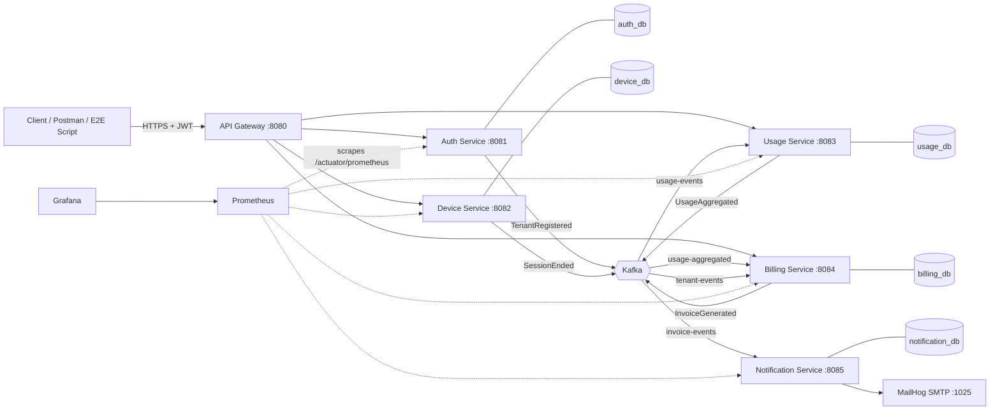

### 4.2 Service Responsibilities & Data Ownership

| Service | Owns (bounded context) | DB | Publishes | Consumes |
|---|---|---|---|---|
| **auth-service** | Tenants, users, credentials, roles | `auth_db` | `tenant-events` | none |
| **device-service** | Devices, sessions, status | `device_db` | `usage-events` | none |
| **usage-service** | Usage facts & aggregates | `usage_db` | `usage-aggregated` | `usage-events` |
| **billing-service** | Plans, monthly usage snapshot, invoices | `billing_db` | `invoice-events` | `usage-aggregated`, `tenant-events` |
| **notification-service** | Delivery log, templates | `notification_db` | none | `invoice-events` |
| **api-gateway** | Routing, edge security, rate limiting | none | none | none |

**Bounded context example:** "User" in auth means credentials + roles. In billing, the payer is a "Tenant/Account". Same real-world person, different model.

### 4.3 Kafka Topics

| Topic | Key | Partitions (local) | Producer | Consumer group | Notes |
|---|---|---|---|---|---|
| `tenant-events` | `tenantId` | 3 | auth | `billing-group` | Tenant created |
| `usage-events` | `tenantId` | 6 | device | `usage-group` | Key = tenantId keeps per-tenant ordering |
| `usage-events.DLT` | `tenantId` | 1 | usage (recoverer) | manual | Poison messages |
| `usage-aggregated` | `tenantId` | 3 | usage | `billing-group` | |
| `invoice-events` | `tenantId` | 3 | billing | `notification-group` | |

**Why key by `tenantId`?** Kafka guarantees order only within a partition. Same key → same partition → one tenant's events are processed in order.

### 4.4 Security Design

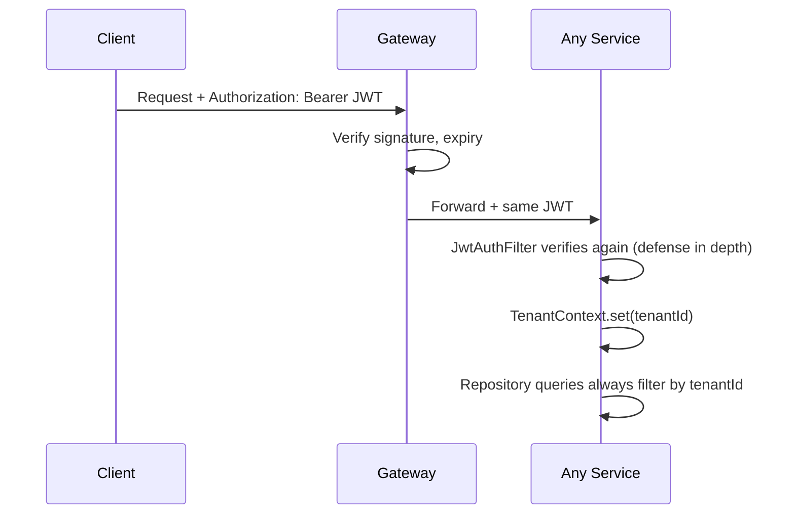

**JWT claims:** `sub` (userId), `tenantId`, `roles` (`ROLE_ADMIN`, `ROLE_USER`), `iat`, `exp`.

**Rule:** `tenantId` is ALWAYS taken from the token, never from the request body or URL.

### 4.5 Reliability Design

| Concern | Mechanism |
|---|---|
| Duplicate Kafka delivery | Idempotent consumer (`processed_events`) |
| Lost event after DB commit | Transactional outbox (device-service) |
| Poison message | Retry w/ backoff, then DLT |
| Concurrent device allocation | Optimistic locking (`@Version`) |
| Service crash | Docker restart policy → K8s self-healing |
| Slow consumers | Consumer lag metric + alert |

---

## 5. Shared Contracts (common module)

> Only DTOs/constants. **No entities, no business logic, no Spring beans.**

### 5.1 Package layout

```
com.saas.common
├── events
│   ├── BaseEvent.java
│   ├── TenantRegisteredEvent.java
│   ├── SessionEndedEvent.java
│   ├── UsageAggregatedEvent.java
│   └── InvoiceGeneratedEvent.java
├── constants
│   ├── Topics.java
│   └── JwtClaims.java
└── enums
    ├── PlanType.java
    └── Role.java
```

### 5.2 Classes (Java 21 records)

```java
public final class Topics {
    public static final String TENANT_EVENTS     = "tenant-events";
    public static final String USAGE_EVENTS      = "usage-events";
    public static final String USAGE_AGGREGATED  = "usage-aggregated";
    public static final String INVOICE_EVENTS    = "invoice-events";
    private Topics() {}
}

public final class JwtClaims {
    public static final String TENANT_ID = "tenantId";
    public static final String ROLES     = "roles";
    private JwtClaims() {}
}

public enum PlanType { FREE_TIER, FLAT_RATE, TIERED }
public enum Role     { ROLE_ADMIN, ROLE_USER }

public record TenantRegisteredEvent(
    UUID eventId, UUID tenantId, String tenantName,
    String adminEmail, PlanType planType, Instant occurredAt) {}

public record SessionEndedEvent(
    UUID eventId, UUID tenantId, UUID deviceId, UUID sessionId,
    long durationSec, Instant startedAt, Instant endedAt) {}

public record UsageAggregatedEvent(
    UUID eventId, UUID tenantId, String period /* YYYY-MM */,
    long totalSeconds, long totalSessions, Instant occurredAt) {}

public record InvoiceGeneratedEvent(
    UUID eventId, UUID tenantId, UUID invoiceId, String invoiceNumber,
    String period, BigDecimal totalAmount, String currency,
    String recipientEmail, Instant occurredAt) {}
```

### 5.3 Event JSON example

```json
{
  "eventId": "6f1c3a8e-2b7a-4c9e-9f0a-1d2e3f4a5b6c",
  "tenantId": "a3b1c2d4-0000-4000-8000-000000000001",
  "deviceId": "d1111111-0000-4000-8000-000000000042",
  "sessionId": "5e551011-0000-4000-8000-000000000981",
  "durationSec": 1800,
  "startedAt": "2026-10-02T09:45:00Z",
  "endedAt": "2026-10-02T10:15:00Z"
}
```

**Rules:** UUID `eventId` on every event (idempotency key). Add fields only (backward compatible); never rename or remove them. Use `BigDecimal` for money, never `double`.

---

## 6. Low-Level Design (LLD) per Service

### Common package convention (each service)

```
com.saas.<service>
├── config        (SecurityConfig, KafkaConfig, etc.)
├── controller    (REST only: validate, delegate, map)
├── dto           (request/response objects)
├── service       (business logic, @Transactional here)
├── repository    (Spring Data JPA)
├── entity        (JPA entities)
├── mapper        (entity <-> dto)
├── exception     (custom exceptions + @RestControllerAdvice)
├── security      (JWT filter, TenantContext)
├── messaging     (producers/consumers)
└── util
```

**Layer rule:** Controller → Service → Repository. Never controller → repository.

---

### 6.1 auth-service (BUILD FIRST)

#### Responsibility
Register tenants (and their first admin), authenticate users, issue JWTs, publish `TenantRegistered`.

#### REST API

| Method | Path | Auth | Request | Response |
|---|---|---|---|---|
| POST | `/auth/register-tenant` | public | `RegisterTenantRequest` | 201 `TenantResponse` |
| POST | `/auth/login` | public | `LoginRequest` | 200 `LoginResponse` |
| POST | `/auth/users` | ADMIN | `CreateUserRequest` | 201 `UserResponse` |
| GET | `/auth/me` | any | none | `UserResponse` |

#### DTOs

```java
record RegisterTenantRequest(
    @NotBlank String tenantName,
    @Email @NotBlank String adminEmail,
    @NotBlank @Size(min = 8) String password,
    PlanType planType) {}

record LoginRequest(@Email String email, @NotBlank String password) {}

record LoginResponse(String accessToken, String tokenType, long expiresInSec) {}

record TenantResponse(UUID tenantId, String tenantName, UUID adminUserId) {}

record CreateUserRequest(@Email String email, @NotBlank String password, Role role) {}

record UserResponse(UUID userId, UUID tenantId, String email, Role role) {}
```

#### DB schema (Flyway `V1__init.sql`)

```sql
CREATE TABLE tenants (
  id            UUID PRIMARY KEY,
  name          VARCHAR(150) NOT NULL UNIQUE,
  plan_type     VARCHAR(20)  NOT NULL,
  status        VARCHAR(20)  NOT NULL DEFAULT 'ACTIVE',
  created_at    TIMESTAMPTZ  NOT NULL DEFAULT now()
);

CREATE TABLE users (
  id            UUID PRIMARY KEY,
  tenant_id     UUID NOT NULL REFERENCES tenants(id),
  email         VARCHAR(200) NOT NULL UNIQUE,
  password_hash VARCHAR(100) NOT NULL,
  role          VARCHAR(20)  NOT NULL,
  enabled       BOOLEAN      NOT NULL DEFAULT TRUE,
  created_at    TIMESTAMPTZ  NOT NULL DEFAULT now()
);
CREATE INDEX idx_users_tenant ON users(tenant_id);
```

#### Class diagram

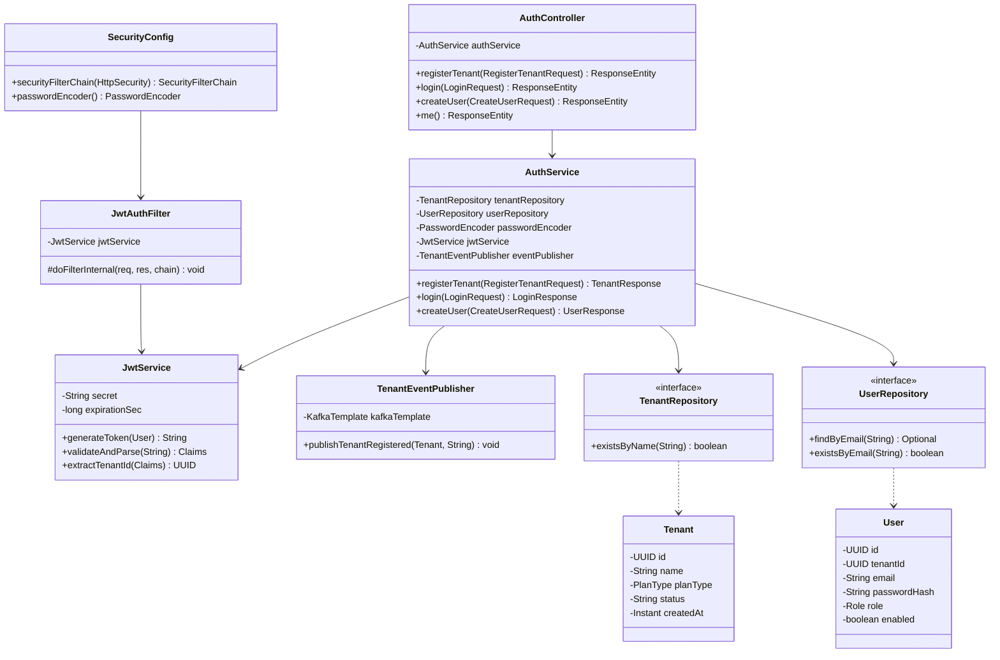

#### Entity sketch

```java
@Entity @Table(name = "tenants")
public class Tenant {
    @Id private UUID id;
    @Column(nullable = false, unique = true) private String name;
    @Enumerated(EnumType.STRING) private PlanType planType;
    private String status;
    private Instant createdAt;
}

@Entity @Table(name = "users")
public class User {
    @Id private UUID id;
    @Column(name = "tenant_id", nullable = false) private UUID tenantId;
    @Column(nullable = false, unique = true) private String email;
    private String passwordHash;
    @Enumerated(EnumType.STRING) private Role role;
    private boolean enabled;
}
```

#### Key logic: `registerTenant` (in one `@Transactional`)
1. Reject if tenant name or email exists → `409 Conflict`.
2. Create `Tenant` (UUID, plan default `FREE_TIER`).
3. Create admin `User` with `passwordEncoder.encode(...)`.
4. Save both.
5. Publish `TenantRegisteredEvent` (after commit; use `@TransactionalEventListener(AFTER_COMMIT)`).
6. Return `TenantResponse`.

#### Exceptions
`DuplicateResourceException` (409), `InvalidCredentialsException` (401), `GlobalExceptionHandler` returns a uniform `ErrorResponse(timestamp, status, code, message, path)`.

---

### 6.2 device-service

#### Responsibility
Manage a tenant's devices and run sessions. Emit `SessionEnded` reliably (outbox).

#### REST API

| Method | Path | Role | Description |
|---|---|---|---|
| POST | `/devices` | ADMIN | Create device |
| GET | `/devices` | any | List tenant's devices (paged) |
| GET | `/devices/{id}` | any | Get one (404 if other tenant's) |
| PUT | `/devices/{id}` | ADMIN | Update |
| DELETE | `/devices/{id}` | ADMIN | Retire device |
| POST | `/devices/{id}/sessions/start` | any | Start session → 201 `SessionResponse` |
| POST | `/sessions/{sessionId}/end` | any | End session |
| GET | `/sessions` | any | List sessions |

#### DB schema

```sql
CREATE TABLE devices (
  id           UUID PRIMARY KEY,
  tenant_id    UUID NOT NULL,
  name         VARCHAR(100) NOT NULL,
  type         VARCHAR(20)  NOT NULL,       -- BROWSER, MOBILE, TABLET
  os           VARCHAR(50),
  status       VARCHAR(20)  NOT NULL,       -- AVAILABLE, IN_USE, OFFLINE, RETIRED
  version      BIGINT       NOT NULL DEFAULT 0,   -- optimistic lock
  created_at   TIMESTAMPTZ  NOT NULL DEFAULT now(),
  UNIQUE (tenant_id, name)
);
CREATE INDEX idx_devices_tenant ON devices(tenant_id);

CREATE TABLE device_sessions (
  id           UUID PRIMARY KEY,
  tenant_id    UUID NOT NULL,
  device_id    UUID NOT NULL REFERENCES devices(id),
  user_id      UUID NOT NULL,
  status       VARCHAR(20) NOT NULL,        -- ACTIVE, ENDED
  started_at   TIMESTAMPTZ NOT NULL,
  ended_at     TIMESTAMPTZ,
  duration_sec BIGINT
);
CREATE INDEX idx_sessions_tenant ON device_sessions(tenant_id);
-- Only one ACTIVE session per device:
CREATE UNIQUE INDEX uq_active_session_per_device
  ON device_sessions(device_id) WHERE status = 'ACTIVE';

CREATE TABLE outbox_events (
  id             UUID PRIMARY KEY,
  aggregate_type VARCHAR(50)  NOT NULL,
  aggregate_id   UUID         NOT NULL,
  topic          VARCHAR(100) NOT NULL,
  event_key      VARCHAR(100) NOT NULL,
  payload        JSONB        NOT NULL,
  status         VARCHAR(20)  NOT NULL DEFAULT 'PENDING',  -- PENDING, SENT, FAILED
  created_at     TIMESTAMPTZ  NOT NULL DEFAULT now(),
  sent_at        TIMESTAMPTZ
);
CREATE INDEX idx_outbox_pending ON outbox_events(status, created_at);
```

**Double protection against double allocation:** `@Version` (optimistic lock) + partial unique index (DB-level guarantee).

#### Class diagram

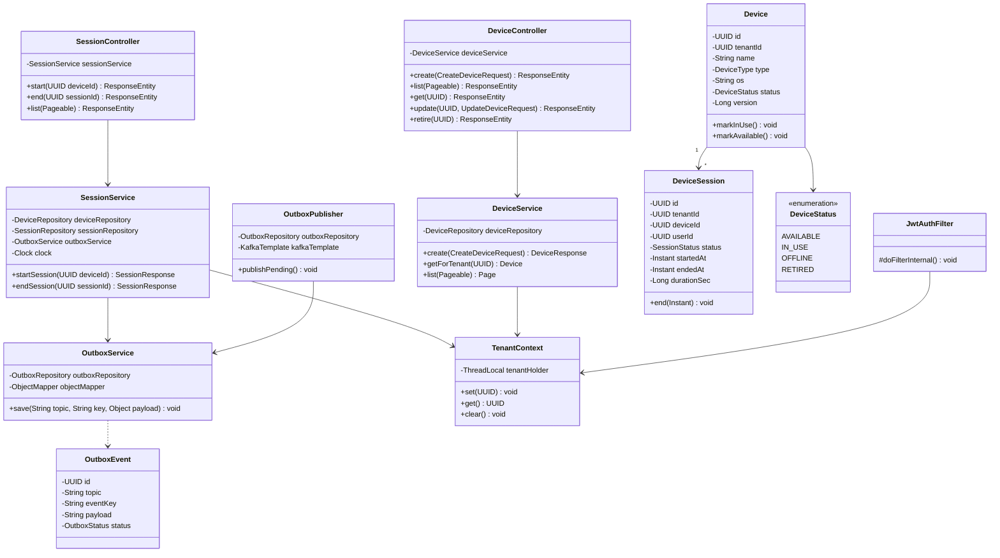

#### Key logic: `startSession(deviceId)` (`@Transactional`)
1. `tenantId = TenantContext.get()`
2. `device = deviceRepository.findByIdAndTenantId(deviceId, tenantId)` or throw `NotFoundException` (never reveal other tenants' devices).
3. If `status != AVAILABLE` → `409 DeviceNotAvailableException`.
4. `device.markInUse()` (version bump on flush; concurrent loser gets `OptimisticLockingFailureException` → map to 409).
5. Create `DeviceSession` (ACTIVE, `startedAt = clock.instant()`).
6. Return `SessionResponse`.

#### Key logic: `endSession(sessionId)` (`@Transactional`)
1. Load session by `id + tenantId`; must be ACTIVE.
2. `session.end(now)` → sets `endedAt`, `durationSec = Duration.between(...).getSeconds()`.
3. `device.markAvailable()`.
4. `outboxService.save(Topics.USAGE_EVENTS, tenantId.toString(), SessionEndedEvent)`: **same transaction**.
5. Commit. `OutboxPublisher` (`@Scheduled(fixedDelay=1000)`) sends PENDING rows, marks SENT.

**Transactional outbox, defined:** write the DB change and the "to be published" message in one local transaction; a separate process forwards the message. This removes the dual-write problem (DB commit succeeded, Kafka publish failed).

**Real-life example:** A restaurant waiter writes the order and the "tell the kitchen" note on the same ticket. The kitchen runner delivers tickets later, so a lost shout can't lose an order.

#### Tenant-isolation enforcement
- `JwtAuthFilter` sets `TenantContext`, and clears it in `finally`.
- All repository methods take `tenantId` (e.g. `findByIdAndTenantId`) **or** use a Hibernate `@Filter("tenantFilter")` enabled per request via an aspect.
- Add a test: Tenant B requests Tenant A's device id → `404`.

---

### 6.3 usage-service

#### Responsibility
Consume `SessionEnded`, deduplicate, aggregate, expose summaries, publish `UsageAggregated`.

#### Kafka consumer config
- Group: `usage-group`; `enable-auto-commit=false`; `ack-mode=RECORD` (or `MANUAL`)
- `JsonDeserializer` with `trusted.packages=com.saas.common.events`
- Error handling: `DefaultErrorHandler(DeadLetterPublishingRecoverer, ExponentialBackOff(1s, x2, max 3 retries))`
- Non-retryable: `JsonProcessingException`, `IllegalArgumentException` → straight to DLT

#### DB schema

```sql
CREATE TABLE processed_events (
  event_id     UUID PRIMARY KEY,            -- uniqueness = idempotency
  processed_at TIMESTAMPTZ NOT NULL DEFAULT now()
);

CREATE TABLE usage_records (
  id           UUID PRIMARY KEY,
  tenant_id    UUID NOT NULL,
  device_id    UUID NOT NULL,
  session_id   UUID NOT NULL UNIQUE,
  duration_sec BIGINT NOT NULL,
  started_at   TIMESTAMPTZ NOT NULL,
  ended_at     TIMESTAMPTZ NOT NULL
);
CREATE INDEX idx_usage_rec_tenant_time ON usage_records(tenant_id, ended_at);

CREATE TABLE usage_monthly (
  tenant_id      UUID NOT NULL,
  period         CHAR(7) NOT NULL,          -- YYYY-MM
  total_seconds  BIGINT NOT NULL DEFAULT 0,
  total_sessions BIGINT NOT NULL DEFAULT 0,
  updated_at     TIMESTAMPTZ NOT NULL DEFAULT now(),
  PRIMARY KEY (tenant_id, period)
);
```

#### Class diagram

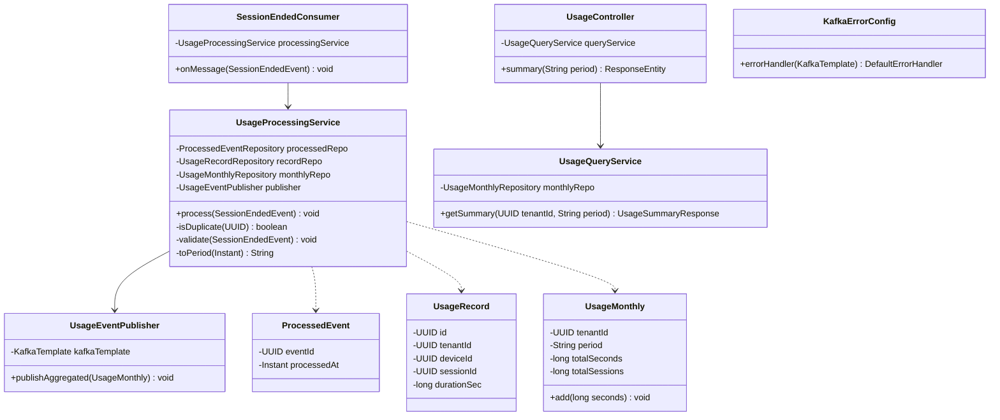

#### Key logic: `process(event)` (`@Transactional`)
1. `validate`: `tenantId`, `sessionId` not null; `durationSec >= 0`; `endedAt >= startedAt` → else throw non-retryable `InvalidEventException`.
2. **Idempotency:** `processedRepo.save(new ProcessedEvent(eventId))`, catching `DataIntegrityViolationException` → log "duplicate" and **return**. (Insert-first is race-safe; check-then-insert is not.)
3. Insert `UsageRecord` (the `session_id` unique key is a second guard).
4. Upsert `UsageMonthly` for `(tenantId, period)`, add seconds, increment sessions.
5. After commit → publish `UsageAggregatedEvent`.

**Idempotent consumer, defined:** a consumer where handling the same message N times has the same effect as once.
**Real-life example:** A bank rejects a cheque with a number it has already cleared.

#### REST
`GET /usage/summary?period=2026-10` → `{ tenantId, period, totalSeconds, totalMinutes, totalSessions }`

---

### 6.4 billing-service

#### Responsibility
Keep each tenant's plan, store monthly usage snapshots, compute and store invoices, publish `InvoiceGenerated`.

#### Pricing model (config-driven)

| Plan | Rule |
|---|---|
| `FREE_TIER` | First 100 min free, then ₹3/min |
| `FLAT_RATE` | ₹999/month flat, includes 1,000 min; ₹2/min beyond |
| `TIERED` | 0-500 min: ₹2/min; 501-2000: ₹1.5/min; 2001+: ₹1/min |

#### REST API

| Method | Path | Role | Description |
|---|---|---|---|
| POST | `/billing/invoices/generate?period=YYYY-MM` | ADMIN | Generate invoice for caller's tenant |
| GET | `/billing/invoices` | any | List tenant's invoices |
| GET | `/billing/invoices/{id}` | any | Invoice with lines |
| GET | `/billing/plan` | any | Current plan |

#### DB schema

```sql
CREATE TABLE tenant_plans (
  tenant_id     UUID PRIMARY KEY,
  tenant_name   VARCHAR(150) NOT NULL,
  billing_email VARCHAR(200) NOT NULL,
  plan_type     VARCHAR(20)  NOT NULL,
  currency      CHAR(3)      NOT NULL DEFAULT 'INR'
);

CREATE TABLE usage_monthly_snapshot (
  tenant_id     UUID NOT NULL,
  period        CHAR(7) NOT NULL,
  total_seconds BIGINT NOT NULL,
  updated_at    TIMESTAMPTZ NOT NULL DEFAULT now(),
  PRIMARY KEY (tenant_id, period)
);

CREATE TABLE invoices (
  id             UUID PRIMARY KEY,
  tenant_id      UUID NOT NULL,
  invoice_number VARCHAR(30) NOT NULL UNIQUE,
  period         CHAR(7) NOT NULL,
  total_amount   NUMERIC(12,2) NOT NULL,
  currency       CHAR(3) NOT NULL,
  status         VARCHAR(20) NOT NULL,       -- GENERATED, SENT, PAID, VOID
  created_at     TIMESTAMPTZ NOT NULL DEFAULT now(),
  UNIQUE (tenant_id, period)                 -- one invoice per tenant per month
);

CREATE TABLE invoice_lines (
  id          UUID PRIMARY KEY,
  invoice_id  UUID NOT NULL REFERENCES invoices(id),
  description VARCHAR(200) NOT NULL,
  quantity    NUMERIC(12,2) NOT NULL,
  unit_price  NUMERIC(12,4) NOT NULL,
  amount      NUMERIC(12,2) NOT NULL
);

CREATE TABLE processed_events (
  event_id     UUID PRIMARY KEY,
  processed_at TIMESTAMPTZ NOT NULL DEFAULT now()
);
```

#### Class diagram (Strategy + Factory)

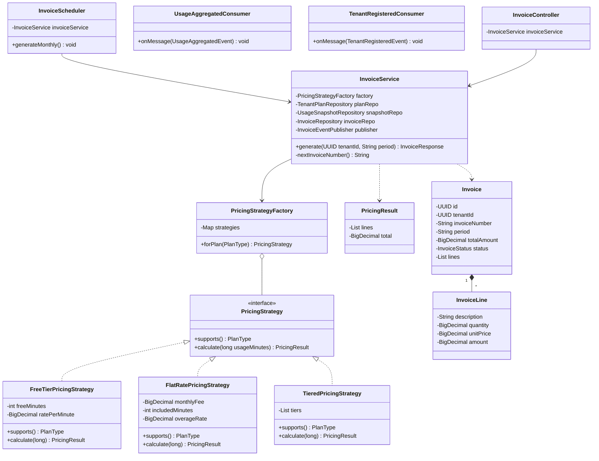

#### Key logic: `generate(tenantId, period)` (`@Transactional`)
1. If invoice exists for `(tenantId, period)` → return existing (idempotent).
2. Load `TenantPlan` and `UsageSnapshot` (missing snapshot → usage = 0).
3. `minutes = ceil(totalSeconds / 60.0)`.
4. `strategy = factory.forPlan(plan.planType)`; `result = strategy.calculate(minutes)`.
5. Build `Invoice` + `InvoiceLine`s; number = `INV-{yyyyMM}-{sequence}`.
6. Save. After commit → publish `InvoiceGeneratedEvent`.

**Worked example (FLAT_RATE):** usage 1,300 min → fee ₹999 + (1,300−1,000)×₹2 = **₹1,599**.

**Money rules:** `BigDecimal`, `RoundingMode.HALF_UP`, scale 2. Never `double`.

---

### 6.5 notification-service

#### Responsibility
Consume `InvoiceGenerated`, send email, record a delivery log.

#### DB schema

```sql
CREATE TABLE notification_log (
  id          UUID PRIMARY KEY,
  event_id    UUID NOT NULL UNIQUE,         -- dedupe
  tenant_id   UUID NOT NULL,
  channel     VARCHAR(20) NOT NULL,         -- EMAIL
  recipient   VARCHAR(200) NOT NULL,
  subject     VARCHAR(200) NOT NULL,
  status      VARCHAR(20) NOT NULL,         -- SENT, FAILED
  error       TEXT,
  created_at  TIMESTAMPTZ NOT NULL DEFAULT now()
);
```

#### Class diagram (Strategy for channels, Observer via Kafka)

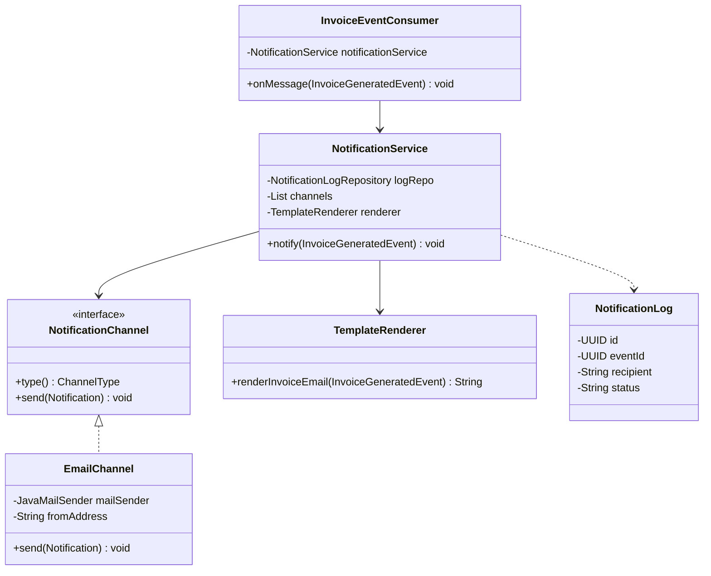

#### Key logic
1. Insert into `notification_log` by `event_id` (unique) → duplicate means skip.
2. Render plain-text/HTML body (tenant name, invoice number, period, amount).
3. `EmailChannel.send` → MailHog SMTP.
4. Mark SENT/FAILED. On failure, throw to trigger retry → DLT.

---

### 6.6 api-gateway

#### Responsibility
Single entry. Route, verify JWT, rate limit, propagate trace id.

#### Routes

| Path | Target |
|---|---|
| `/auth/**` | `http://auth-service:8081` (public: `/auth/login`, `/auth/register-tenant`) |
| `/devices/**`, `/sessions/**` | `http://device-service:8082` |
| `/usage/**` | `http://usage-service:8083` |
| `/billing/**` | `http://billing-service:8084` |

#### Classes

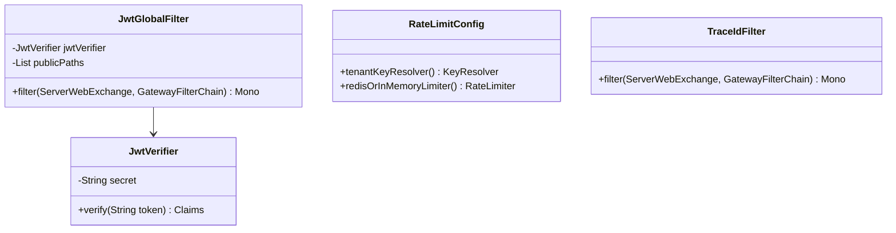

Rate limit key = `tenantId` from JWT (fair per-tenant limiting). Start with an in-memory limiter; Redis later.

---

### 6.7 Entity Relationship Overview (logical, across services)

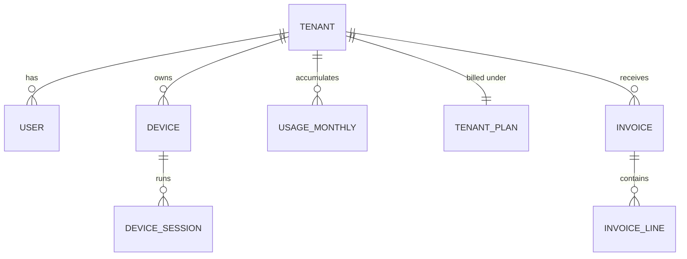

> Logical only. Physically these live in **different databases** and link by `tenant_id` values (no cross-DB foreign keys).

---

## 7. UML: Sequence & State Diagrams

### 7.1 Register & Login

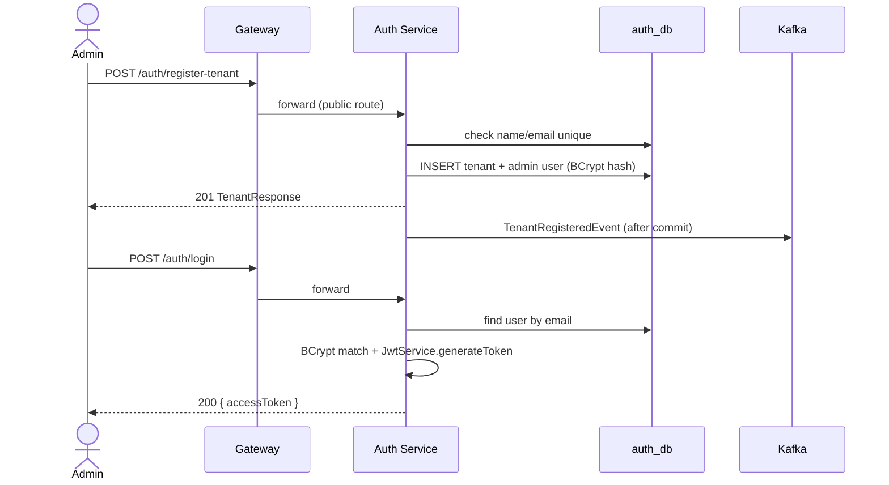

### 7.2 Session → Usage → Invoice → Email (main flow)

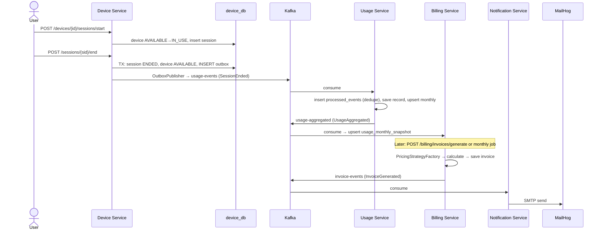

### 7.3 Failure path: poison message

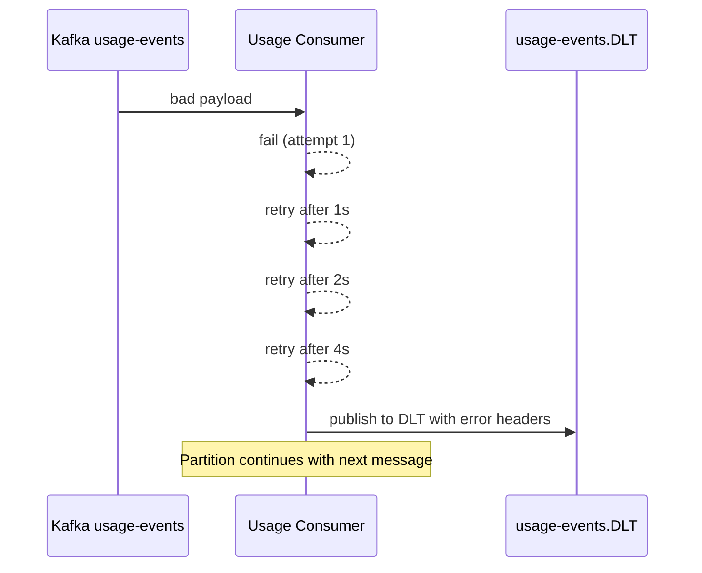

### 7.4 Device State Machine

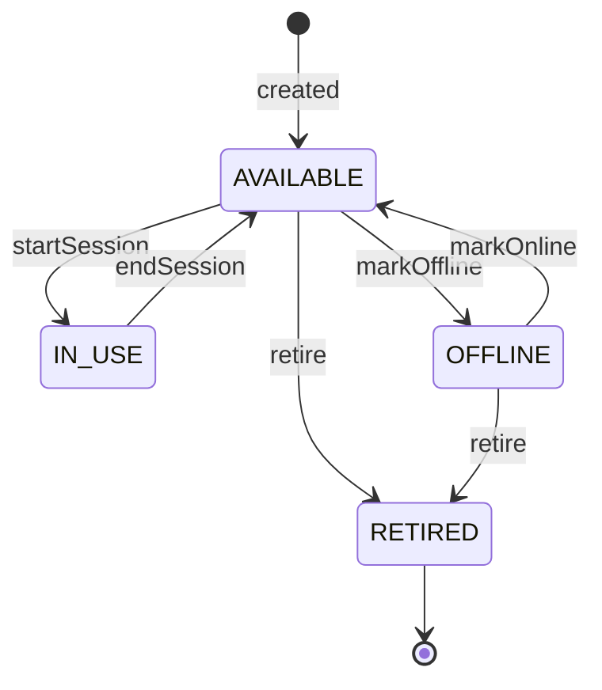

### 7.5 Invoice State Machine

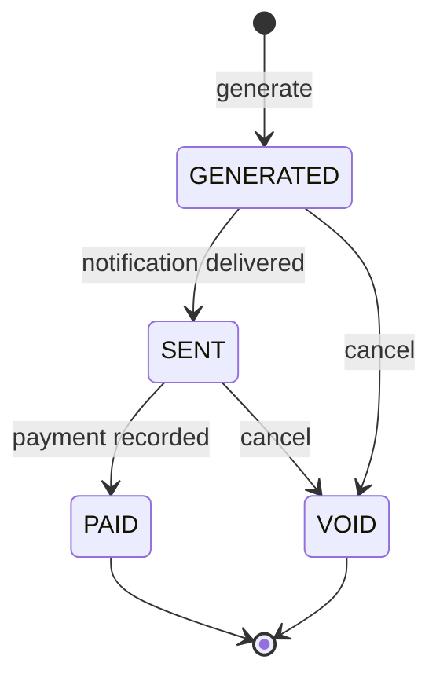

### 7.6 Deployment View (Stage 1)

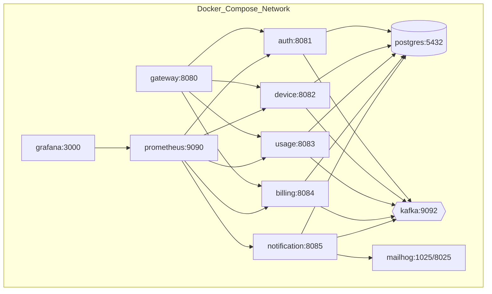

---

## 8. Design Patterns Map

| Pattern | Where | Why |
|---|---|---|
| **Strategy** | `PricingStrategy` (billing); `NotificationChannel` | Swap algorithm per plan/channel without `if/else` chains |
| **Factory** | `PricingStrategyFactory` | Select the strategy by `PlanType` |
| **Observer / Pub-Sub** | Kafka topics | Producers don't know consumers |
| **Transactional Outbox** | device-service | Reliable DB+event atomicity |
| **Idempotent Consumer** | usage, billing, notification | Safe under at-least-once delivery |
| **Repository** | Spring Data | Abstract persistence |
| **DTO / Mapper** | All controllers | Never expose entities |
| **Builder** | Entities/Responses | Readable construction |
| **Template Method** | Base consumer error handling (optional) | Shared flow, custom step |
| **Saga (later)** | Backlog: invoice revert/compensation | Distributed consistency |
| **Singleton** | Spring beans (default) | One instance per context |
| **Chain of Responsibility** | Security filter chain, Gateway filters | Ordered request processing |

**SOLID quick mapping**
- **S**: `JwtService` only handles JWT; `InvoiceService` only invoicing.
- **O**: Add a new plan = new `PricingStrategy` class, no changes to `InvoiceService`.
- **L**: Any `PricingStrategy` is usable where the interface is expected.
- **I**: Small interfaces (`PricingStrategy`, `NotificationChannel`).
- **D**: Services depend on interfaces and are injected by Spring.

---

## 9. Configuration Variables

### 9.1 Environment variables (all services)

| Variable | Example | Used by |
|---|---|---|
| `SPRING_PROFILES_ACTIVE` | `local` / `docker` / `k8s` / `aws` | all |
| `SERVER_PORT` | `8081` | all |
| `DB_URL` | `jdbc:postgresql://postgres:5432/auth_db` | all but gateway |
| `DB_USERNAME` | `saas_user` | all but gateway |
| `DB_PASSWORD` | `change-me` (secret) | all but gateway |
| `KAFKA_BOOTSTRAP_SERVERS` | `kafka:9092` | all but gateway |
| `JWT_SECRET` | 256-bit base64 string (secret) | auth, device, usage, billing, gateway |
| `JWT_EXPIRATION_SEC` | `3600` | auth |
| `MAIL_HOST` / `MAIL_PORT` | `mailhog` / `1025` | notification |
| `MAIL_FROM` | `billing@saas.local` | notification |
| `OUTBOX_POLL_INTERVAL_MS` | `1000` | device |
| `OUTBOX_BATCH_SIZE` | `100` | device |
| `KAFKA_CONSUMER_MAX_RETRIES` | `3` | usage, billing, notification |
| `INVOICE_CRON` | `0 0 2 1 * *` | billing |
| `RATE_LIMIT_REPLENISH` / `RATE_LIMIT_BURST` | `20` / `40` | gateway |

### 9.2 `application.yml` sample (device-service)

```yaml
server:
  port: ${SERVER_PORT:8082}
spring:
  application:
    name: device-service
  datasource:
    url: ${DB_URL:jdbc:postgresql://localhost:5432/device_db}
    username: ${DB_USERNAME:saas_user}
    password: ${DB_PASSWORD:saas_pass}
  jpa:
    hibernate:
      ddl-auto: validate          # Flyway owns the schema
    open-in-view: false
    properties:
      hibernate.jdbc.time_zone: UTC
  flyway:
    enabled: true
  kafka:
    bootstrap-servers: ${KAFKA_BOOTSTRAP_SERVERS:localhost:9092}
    producer:
      acks: all
      properties:
        enable.idempotence: true
      key-serializer: org.apache.kafka.common.serialization.StringSerializer
      value-serializer: org.springframework.kafka.support.serializer.JsonSerializer
app:
  jwt:
    secret: ${JWT_SECRET}
  outbox:
    poll-interval-ms: ${OUTBOX_POLL_INTERVAL_MS:1000}
    batch-size: ${OUTBOX_BATCH_SIZE:100}
management:
  endpoints.web.exposure.include: health,info,prometheus
  endpoint.health.probes.enabled: true
```

### 9.3 Important class-level variables (cheat sheet)

| Class | Key fields |
|---|---|
| `JwtService` | `secret`, `expirationSec`, `signingKey (SecretKey)`, `issuer` |
| `TenantContext` | `static ThreadLocal<UUID> tenantHolder` |
| `OutboxPublisher` | `batchSize`, `pollIntervalMs`, `kafkaTemplate` |
| `UsageProcessingService` | `processedRepo`, `recordRepo`, `monthlyRepo`, `publisher` |
| `PricingStrategy` impls | `freeMinutes`, `ratePerMinute`, `monthlyFee`, `includedMinutes`, `overageRate`, `tiers` |
| `InvoiceService` | `factory`, `planRepo`, `snapshotRepo`, `invoiceRepo`, `publisher`, `clock` |
| `EmailChannel` | `mailSender`, `fromAddress` |

### 9.4 Naming conventions
- Tables: `snake_case` plural; columns: `snake_case`
- Java: `PascalCase` classes, `camelCase` fields; constants `UPPER_SNAKE`
- Topics: `kebab-case`; DLT suffix `.DLT`
- Migrations: `V{n}__{description}.sql`
- Git tags: `v0.1-auth`, `v0.2-device`, ..., `v1.0-stage1`
- Always inject `java.time.Clock` rather than calling `Instant.now()` directly (testable time).

---

## 10. Infrastructure: Docker Compose

Starter for `infra/docker-compose.yml` (infrastructure only; add services in Phase 8):

```yaml
services:
  postgres:
    image: postgres:16
    environment:
      POSTGRES_USER: saas_user
      POSTGRES_PASSWORD: saas_pass
    ports: ["5432:5432"]
    volumes:
      - pgdata:/var/lib/postgresql/data
      - ./init-dbs.sql:/docker-entrypoint-initdb.d/init-dbs.sql
    healthcheck:
      test: ["CMD-SHELL", "pg_isready -U saas_user"]
      interval: 5s
      retries: 10

  kafka:
    image: apache/kafka:3.8.0
    ports: ["9092:9092"]
    environment:
      KAFKA_NODE_ID: 1
      KAFKA_PROCESS_ROLES: broker,controller
      KAFKA_LISTENERS: PLAINTEXT://:9092,CONTROLLER://:9093
      KAFKA_ADVERTISED_LISTENERS: PLAINTEXT://localhost:9092
      KAFKA_CONTROLLER_LISTENER_NAMES: CONTROLLER
      KAFKA_LISTENER_SECURITY_PROTOCOL_MAP: CONTROLLER:PLAINTEXT,PLAINTEXT:PLAINTEXT
      KAFKA_CONTROLLER_QUORUM_VOTERS: 1@localhost:9093
      KAFKA_OFFSETS_TOPIC_REPLICATION_FACTOR: 1
      KAFKA_TRANSACTION_STATE_LOG_REPLICATION_FACTOR: 1
      KAFKA_TRANSACTION_STATE_LOG_MIN_ISR: 1

  mailhog:
    image: mailhog/mailhog
    ports: ["1025:1025", "8025:8025"]

volumes:
  pgdata:
```

`infra/init-dbs.sql`:

```sql
CREATE DATABASE auth_db;
CREATE DATABASE device_db;
CREATE DATABASE usage_db;
CREATE DATABASE billing_db;
CREATE DATABASE notification_db;
```

> **Networking note:** when services run *inside* Compose, they must reach Kafka by its internal listener (e.g. `kafka:19092`), not `localhost:9092`. Add a second listener when you containerize services in Phase 8.

### Dockerfile template (multi-stage)

```dockerfile
FROM maven:3.9-eclipse-temurin-21 AS build
WORKDIR /app
COPY pom.xml .
COPY common ./common
COPY <service> ./<service>
RUN mvn -q -pl <service> -am package -DskipTests

FROM eclipse-temurin:21-jre-alpine
WORKDIR /app
RUN addgroup -S app && adduser -S app -G app
COPY --from=build /app/<service>/target/*.jar app.jar
USER app
EXPOSE 8081
ENTRYPOINT ["java","-XX:MaxRAMPercentage=75","-jar","app.jar"]
```

---

## 11. Testing Strategy & E2E Script

| Level | Tools | What to test |
|---|---|---|
| Unit | JUnit 5, Mockito | `PricingStrategy` math, `JwtService`, `UsageProcessingService.validate` |
| Slice | `@DataJpaTest`, `@WebMvcTest` | Repositories, controllers, validation |
| Integration | Testcontainers (Postgres, Kafka) | Flyway migrations, consumer idempotency, outbox → Kafka, DLT |
| Concurrency | `ExecutorService`, `CountDownLatch` | Two threads start session on the same device → exactly 1 succeeds |
| Security | MockMvc | Tenant B cannot read Tenant A's device (404); missing token (401); wrong role (403) |
| Contract | Shared `common` records | Producer and consumer use the same DTO |
| E2E | `scripts/e2e.sh` | Full flow across all containers |

### Must-have test cases

1. Registration with a duplicate email → 409
2. Login with a wrong password → 401
3. JWT with expired `exp` → 401
4. Cross-tenant device access → 404
5. Concurrent `startSession` → one 201, one 409
6. Same `SessionEnded` event delivered twice → one `usage_records` row
7. Malformed event → lands in `usage-events.DLT`
8. `FLAT_RATE` 1,300 min → ₹1,599.00
9. Generate invoice twice for the same period → same invoice returned
10. Invoice event → one email in MailHog

### E2E script outline (`scripts/e2e.sh`)

```bash
#!/usr/bin/env bash
set -euo pipefail
BASE=${BASE_URL:-http://localhost:8080}
MAIL=${MAIL_API:-http://localhost:8025}
EMAIL="admin-$(date +%s)@acme.test"

# 1. Register tenant
curl -sf -X POST $BASE/auth/register-tenant -H 'Content-Type: application/json' \
  -d "{\"tenantName\":\"acme-$RANDOM\",\"adminEmail\":\"$EMAIL\",\"password\":\"Passw0rd!\",\"planType\":\"FLAT_RATE\"}"

# 2. Login
TOKEN=$(curl -sf -X POST $BASE/auth/login -H 'Content-Type: application/json' \
  -d "{\"email\":\"$EMAIL\",\"password\":\"Passw0rd!\"}" | jq -r .accessToken)
AUTH="Authorization: Bearer $TOKEN"

# 3. Create device
DEV=$(curl -sf -X POST $BASE/devices -H "$AUTH" -H 'Content-Type: application/json' \
  -d '{"name":"iphone-15","type":"MOBILE","os":"iOS 18"}' | jq -r .id)

# 4. Start + end session
SID=$(curl -sf -X POST $BASE/devices/$DEV/sessions/start -H "$AUTH" | jq -r .id)
sleep 5
curl -sf -X POST $BASE/sessions/$SID/end -H "$AUTH" > /dev/null

# 5. Wait for usage aggregation, then verify
PERIOD=$(date -u +%Y-%m)
for i in {1..20}; do
  SEC=$(curl -sf "$BASE/usage/summary?period=$PERIOD" -H "$AUTH" | jq -r .totalSeconds)
  [ "$SEC" -ge 5 ] && break; sleep 1
done
[ "$SEC" -ge 5 ] || { echo "FAIL: usage not aggregated"; exit 1; }

# 6. Generate invoice
curl -sf -X POST "$BASE/billing/invoices/generate?period=$PERIOD" -H "$AUTH" | jq .

# 7. Verify email in MailHog
for i in {1..20}; do
  COUNT=$(curl -sf $MAIL/api/v2/messages | jq '.total'); [ "$COUNT" -ge 1 ] && break; sleep 1
done
[ "$COUNT" -ge 1 ] && echo "E2E PASSED" || { echo "FAIL: no email"; exit 1; }
```

---

## 12. Stage 2: Kubernetes Plan

**Entry criterion:** `scripts/e2e.sh` passes on Compose.

| Step | Action | Verify |
|---|---|---|
| 1 | Create a cluster: `kind create cluster` (or minikube) | `kubectl get nodes` |
| 2 | Namespace `saas` | `kubectl get ns` |
| 3 | Install Postgres + Kafka with Bitnami Helm charts | pods Running |
| 4 | Load images into kind: `kind load docker-image ...` | |
| 5 | Per-service manifests: `Deployment`, `Service`, `ConfigMap`, `Secret` | |
| 6 | Probes: readiness `/actuator/health/readiness`; liveness `/actuator/health/liveness` | |
| 7 | Resource `requests/limits` (e.g. 250m CPU / 512Mi) | |
| 8 | Ingress (nginx) → gateway | `curl http://localhost/...` |
| 9 | Run `e2e.sh` against the Ingress | PASS |
| 10 | Resilience drills (below) | |
| 11 | `kube-prometheus-stack` Helm: dashboards for RPS, p95, consumer lag | |
| 12 | Convert to Helm chart / Kustomize (`dev`, `prod` overlays) | |

### Resilience drills
- `kubectl delete pod <usage-pod>` → it self-heals, no event loss.
- `kubectl scale deploy/usage-service --replicas=3` → Kafka rebalances partitions across pods.
- HPA on CPU 60% → generate load → pods scale out.
- Rolling update with a new image tag → zero downtime.
- Kill Kafka pod → consumers reconnect; outbox keeps events safe.

### K8s object checklist per service
`Deployment` · `Service (ClusterIP)` · `ConfigMap` · `Secret` · `HPA (optional)` · `PodDisruptionBudget (optional)` · `ServiceAccount`

---

## 13. Stage 3: AWS Plan

**Entry criterion:** K8s local passes the E2E script and drills.

| Step | AWS piece | Notes |
|---|---|---|
| 1 | Account hygiene: IAM user (no root), MFA, **billing alarm** | Do this before anything else |
| 2 | **ECR** repos per service; push images | GitHub Actions later |
| 3 | **VPC** (public + private subnets, NAT) via Terraform | NAT Gateway costs money; destroy nightly |
| 4 | **EKS** + managed node group (2× t3.medium) | `eksctl` or Terraform |
| 5 | **RDS PostgreSQL** (private subnet, security group allows only EKS nodes) | Multi-AZ later |
| 6 | **Kafka**: Amazon MSK (managed) or Strimzi on EKS (cheaper) | Tear down after testing |
| 7 | **Secrets Manager** + **IRSA** (pods get IAM roles, no static keys) | External Secrets Operator |
| 8 | **AWS Load Balancer Controller** → ALB from Ingress; ACM cert + Route 53 | HTTPS |
| 9 | Email: **SES** replaces MailHog | Sandbox verification needed |
| 10 | CI/CD: GitHub Actions → build → ECR → Helm/Argo CD deploy | |
| 11 | Observability: Managed Prometheus/Grafana or in-cluster stack; CloudWatch logs | |
| 12 | Run `e2e.sh` against the public URL | PASS |

### Cost guardrails
- Budget alarm at a low threshold from day one.
- `terraform destroy` at the end of each session (EKS control plane, NAT, MSK, and ALB bill hourly).
- Prefer a single small node group and the smallest RDS instance.

### High Availability checklist (production-style)
≥2 replicas per service across AZs · RDS Multi-AZ · MSK with 3 brokers, RF=3, `min.insync.replicas=2` · PodDisruptionBudgets · ALB health checks.

---

## 14. Definition of Done Checklist

### Stage 1
- [ ] Compose infra healthy
- [ ] `common` events published as a jar
- [ ] auth: register/login/JWT with `tenantId`
- [ ] device: tenant-isolated CRUD, sessions, optimistic lock, outbox
- [ ] usage: idempotent consumer, DLT, summary API
- [ ] billing: 3 pricing strategies, invoice generation, event publish
- [ ] notification: email in MailHog
- [ ] gateway: routing + JWT + rate limit
- [ ] all services Dockerized; one `docker compose up`
- [ ] Actuator + Prometheus endpoints on all services
- [ ] **`e2e.sh` passes**

### Stage 2
- [ ] All services on kind/minikube with probes and resources
- [ ] Ingress working; `e2e.sh` passes
- [ ] Pod-kill and scale drills done; Grafana dashboard with consumer lag

### Stage 3
- [ ] Images in ECR; EKS + RDS + Kafka up via Terraform
- [ ] IRSA + Secrets Manager; HTTPS via ALB
- [ ] CI/CD pipeline deploys on push
- [ ] `e2e.sh` passes against the public URL; teardown script tested

---

## 15. Backlog (Do Later)

1. Split `user-service` out of auth (DDD exercise)
2. Refresh tokens, OAuth2 social login, RSA keys + JWKS
3. Saga for invoice/usage compensation (`RevertUsageBilledStatus`)
4. Avro + Schema Registry
5. Redis-backed rate limiting and caching
6. Row-Level Security in Postgres for defense in depth
7. Schema-per-tenant option for enterprise tenants
8. Distributed tracing (OpenTelemetry + Tempo/Jaeger), centralized logs (Loki/ELK)
9. Payment gateway integration
10. Webhooks and a usage-threshold alert (80% of plan) notification
11. Contract tests (Spring Cloud Contract / Pact)
12. Chaos testing (kill Kafka, DB failover)

---

### Appendix A: Glossary

| Term | Definition |
|---|---|
| **Walking skeleton** | Thinnest end-to-end implementation, thickened over time |
| **Bounded context** | Boundary within which a domain model/term has one meaning |
| **Idempotency** | Repeating an operation has the same effect as doing it once |
| **At-least-once delivery** | Messages are never lost but may arrive more than once |
| **Outbox pattern** | Persist the event with the state change; forward it asynchronously |
| **DLT** | Dead Letter Topic: parking place for messages that repeatedly fail |
| **Consumer lag** | Number of messages a consumer group is behind the latest offset |
| **Optimistic locking** | Detect conflicting updates via a version column rather than locking rows |
| **IRSA** | IAM Roles for Service Accounts: pod-level AWS permissions in EKS |
| **HPA** | Horizontal Pod Autoscaler: scales replicas by metrics |

### Appendix B: Decision log starter (`docs/decisions.md`)

```
2026-10-02  Database-per-service      Avoid distributed monolith
2026-10-02  Shared-schema multitenancy Simplicity; revisit for enterprise tenants
2026-10-02  Outbox in device-service  Avoid dual-write loss
2026-10-02  Billing via snapshot + generate endpoint  Deterministic E2E tests
2026-10-02  JWT HS256 first           Unblock progress; migrate to RSA later
```
