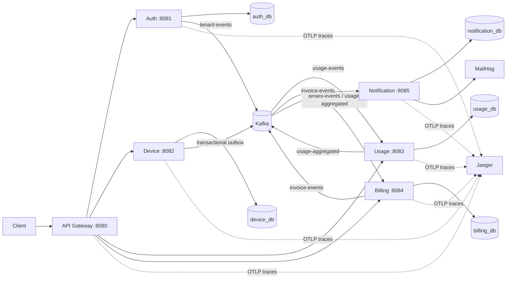
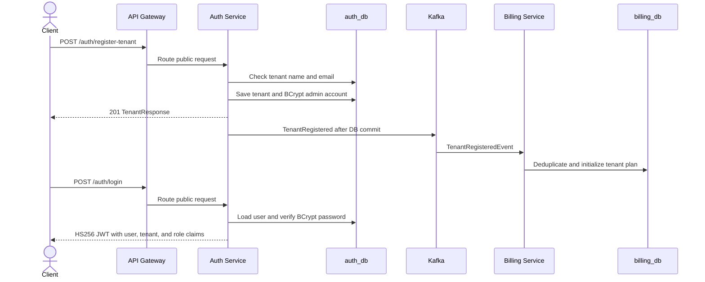
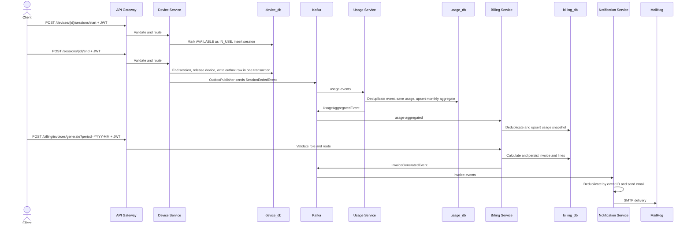
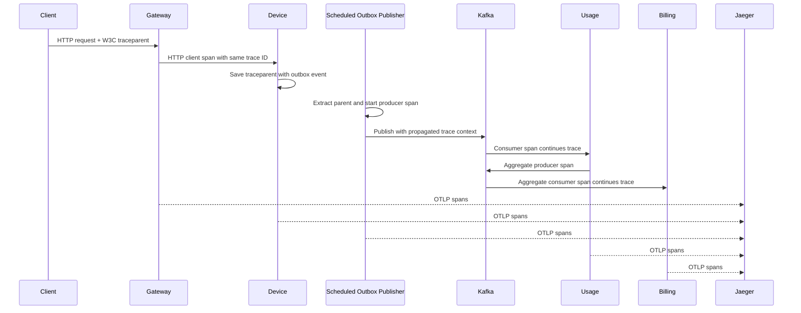

# SaaS Platform Technical Interview Guide

This guide explains the running Stage 1 application in interview-ready language. It covers the request and event flows, the main engineering concepts, why each concept is used, where it appears in the code, how to verify it, and what is still a production limitation.

**Code is the source of truth.** The master plan contains intended designs that are not all implemented. This guide calls out those differences instead of presenting planned work as completed work.

## 1. System at a Glance

The platform provides tenant registration and login, tenant-owned devices and sessions, usage aggregation, monthly invoices, and email notifications. The API gateway is the public entry point. Services own separate PostgreSQL databases and exchange asynchronous events through Kafka.



The technology baseline is Java 21, Spring Boot, Maven, PostgreSQL, Flyway, Kafka, JWT HS256, Micrometer/OpenTelemetry, Jaeger, Prometheus, and MailHog. The parent Maven project and module list are in [pom.xml](../pom.xml); shared topic names, claims, enums, and event records are in [common](../common/src/main/java/com/saas/common).

## 2. End-to-End Sequence

### 2.1 Registration and login



Registration writes the tenant and first admin in one database transaction. Duplicate tenant names and email addresses are rejected. Passwords are stored as BCrypt hashes, never plaintext. A successful login returns a bearer token containing the user ID as `sub`, `tenantId`, and role claims. See [AuthService.java](../auth-service/src/main/java/com/saas/auth/service/AuthService.java), [JwtService.java](../auth-service/src/main/java/com/saas/auth/security/JwtService.java), and [V1__init.sql](../auth-service/src/main/resources/db/migration/V1__init.sql).

### 2.2 Session to invoice email



The end-to-end script exercises this flow through the gateway. In this checkout, the Windows script is [e2e.ps1](../scripts/e2e.ps1); the Bash equivalent is [e2e.sh](../scripts/e2e.sh).

### 2.3 Trace propagation through a session



The database outbox is polled on a different thread, after the original HTTP request has returned. The W3C `traceparent` is therefore persisted with the outbox row in [V2__add_outbox_trace_context.sql](../device-service/src/main/resources/db/migration/V2__add_outbox_trace_context.sql). The publisher restores it through Micrometer's `Propagator`, creates a producer span, and Kafka observation propagates that context to consumers. This is the subtle piece that keeps the session's trace intact across the asynchronous boundary.

## 3. Technical Concepts

Each entry explains the concept, why this application uses it, and where to find it.

### 3.1 Multi-tenancy and tenant isolation

**What it is:** One deployed application serves multiple customer organizations (tenants), while preventing one tenant from reading or changing another tenant's data.

**How this application does it:** The authenticated JWT supplies `tenantId`. Controllers pass that claim into service methods; SQL queries include the tenant ID as part of the predicate. The request body does not choose the tenant for tenant-owned device or billing data.

**Why it matters:** Authentication identifies the caller; tenant scoping authorizes access to a customer's resources. A valid token alone is not enough to access another tenant's device or invoice.

**Where:** [AuthController.java](../auth-service/src/main/java/com/saas/auth/controller/AuthController.java), [DeviceController.java](../device-service/src/main/java/com/saas/device/controller/DeviceController.java), [SessionController.java](../device-service/src/main/java/com/saas/device/controller/SessionController.java), [InvoiceController.java](../billing-service/src/main/java/com/saas/billing/controller/InvoiceController.java), and tenant-scoped SQL in [DeviceService.java](../device-service/src/main/java/com/saas/device/service/DeviceService.java) and [InvoiceService.java](../billing-service/src/main/java/com/saas/billing/service/InvoiceService.java).

**Interview answer:** “We authenticate with a signed JWT, then derive the tenant ID from its claim. Resource queries include both resource ID and tenant ID, so a cross-tenant lookup behaves like not found instead of trusting a tenant ID supplied by the client.”

### 3.2 JWT, HS256, and password hashing

**What they are:** A JWT is a signed bearer token carrying claims. HS256 signs and verifies with the same secret. BCrypt is a deliberately slow password hash that stores no reversible password.

**Why this application uses them:** The gateway and services need a compact identity contract that can be verified without sharing the auth database. Password hashing protects stored credentials if database contents are exposed.

**How it works:** Login checks a BCrypt hash and signs claims for subject, tenant ID, roles, issue time, and expiration. The gateway and each protected service validate the signature with the configured HS256 secret. The same claims are interpreted at each service boundary.

**Where:** [SecurityConfiguration.java](../auth-service/src/main/java/com/saas/auth/config/SecurityConfiguration.java), [JwtService.java](../auth-service/src/main/java/com/saas/auth/security/JwtService.java), and per-service `SecurityConfiguration.java` files. Shared claim names are in [JwtClaims.java](../common/src/main/java/com/saas/common/constants/JwtClaims.java).

**Interview answer:** “BCrypt is for passwords at rest; it is not the JWT algorithm. HS256 signs tokens using a shared secret. For production the secret must be externally managed, high entropy, rotated, and consistent across gateway and resource services. Asymmetric signing/JWKS is a planned evolution.”

### 3.3 Service boundaries and database-per-service

**What it is:** Each service owns its tables and schema. Other services do not query those tables directly; they use APIs or events.

**Why:** It prevents accidental coupling between service schemas and lets teams evolve data ownership independently. The cost is eventual consistency and duplicated read models.

**Where:** Compose provisions `auth_db`, `device_db`, `usage_db`, `billing_db`, and `notification_db` in [01-create-service-databases.sql](../infra/postgres/init/01-create-service-databases.sql). Each service has its own datasource configuration and Flyway migrations under its `src/main/resources/db/migration` directory.

**Interview answer:** “Billing does not join auth or usage tables. It builds a local plan and usage snapshot from Kafka events. This is a small CQRS/read-model pattern and preserves database ownership.”

### 3.4 Flyway schema migration

**What it is:** Versioned SQL migrations apply database changes in order and record completed versions in `flyway_schema_history`.

**Why:** A service can bring up or upgrade its own schema reproducibly. Hibernate is configured to validate rather than silently mutate production schemas.

**Where:** Auth starts with `V1__init.sql`; device uses `V1__init.sql` plus `V2__add_outbox_trace_context.sql`; other service schemas are in their own migration folders. Datasources use `ddl-auto: validate` where JPA is configured.

**Interview answer:** “Flyway owns schema evolution; application startup validates entity/schema agreement. We do not rely on automatic Hibernate DDL updates.”

### 3.5 Shared event contracts and Kafka

**What it is:** Kafka carries asynchronous messages between bounded contexts. The `common` module defines the JSON event records, topic names, claim names, and enums consumed by multiple services.

**Why:** Producers and consumers can scale and fail independently. Keys are tenant IDs so Kafka partitions preserve per-tenant event ordering (within a topic/partition).

**Main event flow:** `TenantRegisteredEvent` → `tenant-events`; `SessionEndedEvent` → `usage-events`; `UsageAggregatedEvent` → `usage-aggregated`; `InvoiceGeneratedEvent` → `invoice-events`.

**Where:** Contracts are in [common events](../common/src/main/java/com/saas/common/events) and [Topics.java](../common/src/main/java/com/saas/common/constants/Topics.java). Producer and consumer classes are in each service's `messaging` package.

**Interview answer:** “The event ID is the idempotency key, tenant ID is the partition key, and the contract lives in `common`. Kafka decouples services, but it introduces eventual consistency and delivery/retry responsibilities.”

### 3.6 Transactional outbox and at-least-once delivery

**What it is:** A database transaction writes both business state and an outbox event row. A separate poller later publishes the event to Kafka.

**Why:** Publishing directly to Kafka and committing PostgreSQL are two independent writes. If one succeeds and the other fails, state and events diverge. The outbox makes the database update and “to publish” record atomic.

**Device flow:** Ending a session updates the session, releases the device, and inserts a JSON event plus trace context in one transaction. The scheduled publisher locks pending rows with `FOR UPDATE SKIP LOCKED`, waits for Kafka acknowledgement, then marks the row sent.

**Trade-off:** A crash after Kafka accepts the message but before the outbox row is marked sent can cause a duplicate publish. Therefore this is at-least-once delivery, not exactly-once. Consumers must be idempotent.

**Where:** [SessionService.java](../device-service/src/main/java/com/saas/device/service/SessionService.java), [OutboxPublisher.java](../device-service/src/main/java/com/saas/device/messaging/OutboxPublisher.java), [V1__init.sql](../device-service/src/main/resources/db/migration/V1__init.sql), and [V2__add_outbox_trace_context.sql](../device-service/src/main/resources/db/migration/V2__add_outbox_trace_context.sql).

**Interview answer:** “The outbox solves the database/Kafka dual-write problem for session events. It does not guarantee a message is delivered exactly once; it guarantees recoverable publication, while consumers deduplicate.”

**Important boundary:** Auth, usage aggregate, and invoice events currently publish after database commit using application events. Those publishers are not durable outboxes yet; a process/broker failure in that gap can lose those messages. This is a known production follow-up.

### 3.7 Idempotent consumers and deduplication

**What it is:** Processing the same event again does not repeat its business effect.

**Why:** Kafka consumers can see duplicate delivery after retries, restarts, or producer/outbox replays. At-least-once delivery is practical; idempotent writes make it safe.

**How it works here:** Usage inserts `eventId` into a table using `ON CONFLICT DO NOTHING` before applying usage. Billing tracks processed event IDs and enforces one invoice per tenant/period. Notification uses a unique event ID and skips events whose email is already marked sent.

**Where:** [UsageProcessingService.java](../usage-service/src/main/java/com/saas/usage/service/UsageProcessingService.java), [BillingEventService.java](../billing-service/src/main/java/com/saas/billing/service/BillingEventService.java), invoice uniqueness in [V1__init.sql](../billing-service/src/main/resources/db/migration/V1__init.sql), and [NotificationService.java](../notification-service/src/main/java/com/saas/notification/service/NotificationService.java).

**Interview answer:** “We insert the event ID under a unique constraint as part of the same transaction as the business write. A duplicate becomes a no-op. A check-then-insert without a unique constraint would race under concurrency.”

### 3.8 Concurrency control and database constraints

**What it is:** The database arbitrates simultaneous requests that compete for the same device.

**How this application does it:** Starting a session performs a conditional atomic update: change status only when the tenant-owned device is `AVAILABLE`. The schema also has a partial unique index allowing only one `ACTIVE` session per device. Both guard against two concurrent starts winning.

**Nuance:** The schema has a `version` column incremented on updates, but this implementation does not use a JPA `@Version` entity. The main guard is the conditional update plus the partial unique index.

**Where:** [SessionService.java](../device-service/src/main/java/com/saas/device/service/SessionService.java), [V1__init.sql](../device-service/src/main/resources/db/migration/V1__init.sql).

### 3.9 Retry, exponential backoff, and dead-letter topics

**What they are:** Retry is for transient failures; exponential backoff increases the delay between attempts; a dead-letter topic stores a message that could not be processed after retry policy exhaustion.

**Why:** Repeated immediate retries worsen a transient outage. A DLT prevents a poison event from blocking the partition indefinitely and keeps the original message available for investigation/replay.

**Where:** Usage configures retries and routes exhausted messages to `<topic>.DLT`; malformed/invalid usage events are non-retryable. Notification configures a bounded exponential retry and invoice DLT. See each service's `KafkaErrorConfiguration.java`.

**Interview answer:** “Retry only failures that may recover. Validation errors are permanent and should go straight to DLT. A DLT is not automatic remediation; it needs monitoring, investigation, and a replay process.”

### 3.10 Pricing strategies and money representation

**What it is:** Strategy objects encapsulate different pricing rules behind a shared interface; a factory selects by `PlanType`.

**Rules implemented:**

- `FREE_TIER`: first 100 minutes free, then INR 3/minute.
- `FLAT_RATE`: INR 999/month includes 1,000 minutes, then INR 2/minute.
- `TIERED`: 0–500 minutes at INR 2; 501–2,000 at INR 1.50; above 2,000 at INR 1.

Usage seconds are rounded up to whole minutes. Money uses `BigDecimal`, never binary floating point. Invoice uniqueness by `(tenant_id, period)` makes generation repeatable.

**Where:** [PricingStrategy.java](../billing-service/src/main/java/com/saas/billing/pricing/PricingStrategy.java), the three strategy classes in that package, [PricingStrategyFactory.java](../billing-service/src/main/java/com/saas/billing/pricing/PricingStrategyFactory.java), and [InvoiceService.java](../billing-service/src/main/java/com/saas/billing/service/InvoiceService.java).

**Interview answer:** “Pricing is open for adding a new plan without putting plan-specific conditionals throughout invoice persistence. `BigDecimal` protects currency calculations from binary rounding errors.”

### 3.11 API gateway, circuit breaker, timeout, and rate limiter

**Gateway:** validates HS256 JWTs; allows registration/login, Actuator, and circuit-breaker fallback routes; requires a valid JWT for other business routes; routes to services; adds trace headers; and applies a per-tenant in-memory token bucket. See [SecurityConfiguration.java](../api-gateway/src/main/java/com/saas/gateway/config/SecurityConfiguration.java), [application.yml](../api-gateway/src/main/resources/application.yml), [TraceIdGlobalFilter.java](../api-gateway/src/main/java/com/saas/gateway/filter/TraceIdGlobalFilter.java), and [TenantRateLimitGlobalFilter.java](../api-gateway/src/main/java/com/saas/gateway/filter/TenantRateLimitGlobalFilter.java).

**Circuit breaker:** each upstream route has its own Resilience4j breaker. It opens after enough failures, returns a controlled `503` fallback with `Retry-After`, then permits half-open probes before closing. The gateway has a 1-second connect timeout, 3-second upstream response timeout, and a 5-second circuit-breaker time limiter.

**Why:** a failing upstream should not accumulate unlimited blocked requests or cascade into callers. The timeout bounds waiting; the circuit breaker bounds repeated calls during the outage; the fallback gives clients a predictable retryable response.

**Where:** `resilience4j.circuitbreaker`, `resilience4j.timelimiter`, and route `CircuitBreaker` filters in [api-gateway application.yml](../api-gateway/src/main/resources/application.yml). The sanitized fallback is in [ServiceFallbackController.java](../api-gateway/src/main/java/com/saas/gateway/controller/ServiceFallbackController.java).

**Production caveat:** the token buckets and breaker state are in-memory per gateway instance. They are not coordinated across replicas. The configured development thresholds/timeouts should be tuned from production latency and error metrics.

### 3.12 Distributed tracing, trace context, and log correlation

**What they are:** A trace groups spans for one logical operation across processes. A span records one timed operation and its parent/child relationship. `traceparent` is the W3C standard HTTP header that carries trace context.

**Mechanism chosen:** Spring Boot Micrometer Observation/Tracing plus the OpenTelemetry bridge creates HTTP and Kafka spans using Spring-native instrumentation. OTLP exports them to Jaeger. The instrumentation is not tied to Jaeger's SDK, so another OTLP-compatible backend can replace it.

**Context path:** HTTP gateway tracing flows to services. Kafka producer/listener observations put context in Kafka headers. Since the device outbox publishes on a later scheduled thread, device service additionally stores `traceparent` on the outbox row and restores it with Micrometer `Propagator` before publishing.

**Logs:** each service's log level pattern includes service name, `traceId`, and `spanId`. Lifecycle logs include resource/event IDs so logs can be searched alongside Jaeger spans. Do not log raw credentials, tokens, passwords, or payloads.

**Where:** OpenTelemetry dependencies and `management.tracing` / `management.otlp.tracing` configuration in each service POM and `application.yml`; Kafka observations are enabled in the Kafka services. Jaeger and OTLP ports are configured in [docker-compose.yml](../infra/docker-compose.yml).

**Why this mechanism:** it aligns Spring HTTP, Kafka, and log instrumentation with one abstraction, uses a vendor-neutral wire/export protocol, and gives a local trace UI without embedding Jaeger-specific code into services.

### 3.13 Health checks, readiness, and containers

Compose health checks verify PostgreSQL, Kafka, MailHog, Prometheus, Grafana, and app Actuator health. `depends_on: condition: service_healthy` orders startup on dependency readiness; `restart: unless-stopped` restarts exited containers. A container health check reports health but does not itself restart an unhealthy process unless an orchestrator or policy takes action.

The shared [Dockerfile.service](../Dockerfile.service) uses a Maven/Java 21 build stage and a smaller Java 21 runtime image. Each app owns its own database and runs Flyway on startup. Jaeger all-in-one stores local traces in memory; use a production collector/backend with durable storage and access control for real deployment.

## 4. Service-by-Service Interview Map

| Service | Owns | Inbound API/events | Outbound API/events | Main concepts |
|---|---|---|---|---|
| Auth | tenants, users, credentials | registration, login, me, create-user | `TenantRegisteredEvent` | BCrypt, JWT, validation, after-commit publish |
| Device | devices, sessions, outbox | tenant-protected CRUD/session routes | `SessionEndedEvent` | conditional update, partial unique index, outbox, trace context |
| Usage | usage facts, monthly totals, processed IDs | `SessionEndedEvent`, summary API | `UsageAggregatedEvent` | idempotency, SQL upsert, retry/DLT |
| Billing | plans, snapshots, invoices, lines | tenant/usage events, invoice APIs | `InvoiceGeneratedEvent` | event dedupe, pricing strategy/factory, BigDecimal, invoice uniqueness |
| Notification | delivery log | `InvoiceGeneratedEvent` | SMTP to MailHog | channel abstraction, idempotency, retry/DLT |
| Gateway | no business database | client HTTP | routes to auth/device/usage/billing | JWT, circuit breaker, timeout, rate limit, tracing |

## 5. Interview Questions and Short Answers

**Why use Kafka instead of synchronous calls for usage and billing?**
Usage and billing can consume independently and build their own read models. Kafka buffers work and reduces direct runtime coupling, at the cost of eventual consistency and explicit retry/idempotency design.

**How do you stop duplicate session events from double-billing?**
Usage inserts the unique `eventId` into `processed_events` in the same transaction as its record and aggregate changes. Billing separately deduplicates input events and makes invoice generation unique by tenant and month.

**What happens if Kafka is down while a session ends?**
The session change and outbox record still commit together. The poller leaves the row pending if publish fails and tries again. This guarantee applies to device session events; the other after-commit publishers still need outboxes for equivalent durability.

**How is one tenant prevented from reading another tenant's device?**
The service extracts `tenantId` from the verified token and queries by both device ID and tenant ID. Missing cross-tenant rows return not found.

**Why not put tenant ID in the request body?**
The caller could claim another tenant. The authenticated claim is the trusted source of tenant identity.

**How does the circuit breaker differ from retry?**
Retry repeats a request that may recover. A breaker stops calls after repeated failures, waits, then allows probes. The gateway uses both a time bound and a breaker; it does not retry writes automatically.

**How are money calculations made safe?**
Usage is rounded up to integer minutes; all monetary values use `BigDecimal` and explicit decimal rates/scales. No `double` is used for invoices.

**How do you trace one session through the system?**
Search Jaeger by the session-end trace ID. The same ID appears in structured log prefixes. The device persists trace context in its outbox; Kafka observations continue it through usage and billing.

**What would you improve before real production traffic?**
Use managed/replicated PostgreSQL and Kafka; external secret management and asymmetric JWT/JWKS; durable outboxes for auth/usage/billing; shared/distributed rate limiting if multiple gateways; persistent secured trace storage; production sampling; alerting and replay procedures for DLTs; plus integration/concurrency/failure-injection tests.

## 6. Comprehensive Interview Question Bank

Use these answers as a starting point, then explain the relevant trade-off and point to the code. No static guide can anticipate every interviewer follow-up; this bank covers the application's implemented paths, design choices, operational limits, and the most likely extensions.

### 6.1 Project and system design

| Question | Answer outline |
|---|---|
| Give a one-minute overview of the application. | It is a Java 21/Spring Boot multi-tenant usage-and-billing platform. The gateway protects/routs HTTP; auth owns tenant identity, device owns devices/sessions, usage consumes session events, billing prices usage, and notification emails invoices. Each business service has its own PostgreSQL database; Kafka connects asynchronous workflows. |
| Who are the users and what is the core business flow? | A tenant administrator registers an organization and users; users run sessions on tenant-owned devices; session duration becomes usage; billing creates a monthly invoice; notification emails it. The complete flow is exercised by `scripts/e2e.ps1` and `scripts/e2e.sh`. |
| Why split the system into services? | The boundaries align with identity, device lifecycle, usage facts, billing, and delivery. Each service owns its data and can evolve independently. The cost is deployment/operational complexity, network failure modes, and eventual consistency. |
| What are the bounded contexts? | Auth models users, credentials, and roles; device models devices and sessions; usage models facts and aggregates; billing models plans and invoices; notification models delivery. A tenant ID is the shared identifier, not a shared entity/database. |
| Why database-per-service rather than one shared database? | It makes ownership enforceable and prevents cross-service joins and schema coupling. Services exchange events and build local projections. It makes cross-service transactions impossible, so idempotency and eventual consistency are necessary. |
| Which calls are synchronous and which are asynchronous? | Client HTTP is synchronous through the gateway. Session-ended, usage-aggregated, tenant-registered, and invoice-generated events travel asynchronously through Kafka. The invoice API reads the billing database; notification is not on the response path. |
| Why does auth publish a tenant event? | Billing needs tenant name, billing email, and plan without querying auth's database. The event creates a local `tenant_plans` projection in billing. |
| Explain the end-to-end event chain. | Auth publishes `TenantRegisteredEvent`; device writes `SessionEndedEvent` to its transactional outbox; usage deduplicates and aggregates it, then publishes `UsageAggregatedEvent`; billing updates a snapshot and generates an invoice; notification consumes `InvoiceGeneratedEvent` and sends email. |
| What consistency model does the system provide? | Each individual service's database operation is locally transactional. Cross-service updates are eventually consistent via Kafka; an API may briefly see a missing plan or usage snapshot while its event is still in flight. |
| Where is the system of record for each piece of data? | Auth owns tenants/users; device owns devices/sessions/outbox; usage owns usage records/monthly totals/processed IDs; billing owns plans/snapshots/invoices; notification owns delivery logs. See each service's Flyway migration. |
| How would you scale this architecture? | Scale stateless HTTP replicas horizontally, partition Kafka by tenant key, size consumer groups/partitions together, and independently scale database pools and services. The current local rate limiter and in-memory Jaeger backend are not shared/production scale components. |
| What is deliberately out of scope? | A frontend, payments, OAuth/social login, refresh tokens, schema registry, sagas, and Stage 2/3 deployments are backlog/roadmap items, not implemented Stage 1 features. |

### 6.2 Java, Spring, and API design

| Question | Answer outline |
|---|---|
| Why Java 21 and Spring Boot? | Java 21 provides a supported LTS baseline and records/modern language features. Spring Boot supplies dependency management, configuration, HTTP servers, validation, security, Actuator, JDBC/JPA, Kafka, and Micrometer integration. |
| Explain Controller → Service → Repository. | Controllers bind/validate HTTP and map responses; services own transactional business rules; repositories/JdbcTemplate access the service's database. This keeps transport concerns out of business logic and prevents controllers from owning SQL. |
| Where are transactions placed and why? | `@Transactional` is on service-layer operations that must commit together: tenant plus admin creation, device/session plus outbox writes, usage dedupe plus aggregation, and invoice plus invoice lines. Spring's proxy applies transactions to calls crossing the proxied bean boundary. |
| Why use request/response DTOs instead of returning entities? | DTOs prevent persistence schema leakage, control which fields are exposed, and provide an API contract independent of ORM details. Request DTOs also carry Bean Validation constraints. |
| How are bad requests handled? | Jakarta Bean Validation checks request DTOs. Auth uses a `@RestControllerAdvice` to return a uniform timestamp/status/code/message/path error object; device, usage, and billing also use HTTP status exceptions for domain errors. |
| What does `@Transactional(readOnly = true)` mean? | It declares query-only intent and allows transaction/provider optimizations. It is not a security control and does not guarantee a read-only database connection in every configuration. |
| Why use JDBC for device/usage/billing instead of JPA? | These slices use explicit SQL for conditional updates, upserts, partial-index-backed concurrency, and PostgreSQL-specific JSONB/outbox behavior. The trade-off is more hand-written mapping and SQL. Auth uses JPA for tenant/user persistence. |
| Why use records for events and DTOs? | Records make immutable data carriers concise and give value-based accessors. They are suitable for serialized event contracts and API response shapes, not mutable JPA entities. |
| Why explicitly name path/query parameters? | Container builds may omit Java parameter-name metadata. Explicit `@PathVariable("id")` and `@RequestParam("period")` avoid relying on reflection/compiler flags. |
| How is scheduling enabled? | Device enables Spring scheduling for outbox polling; billing enables it for monthly invoice generation. The scheduled methods should be idempotent because multiple invocations/restarts are possible. |
| How are local settings separated from deployed settings? | `application.yml` uses environment-variable placeholders for ports, URLs, secrets, Kafka, mail, exporter endpoint, and sampling. Compose supplies container DNS names; host-run services default to localhost ports. |
| Would you expose entities or exception stack traces to clients? | No. Responses should expose stable error contracts, not SQL, credentials, stack traces, or internal hostnames. Detailed exceptions belong in access-controlled logs with a trace ID for support correlation. |

### 6.3 Authentication, authorization, and tenancy

| Question | Answer outline |
|---|---|
| What is the difference between authentication and authorization here? | Auth verifies credentials and issues a token. Gateway/service security verifies the token; route rules then authorize public, authenticated, or admin operations. Tenant-scoped service queries enforce resource ownership separately. |
| What claims are in the JWT? | `sub` is user ID; shared claim constants define `tenantId` and `roles`; issued/expiry times are included. The user role is an authority such as `ROLE_ADMIN` or `ROLE_USER`. |
| Why use BCrypt? | Passwords should be one-way, salted, and deliberately expensive to brute force. BCrypt hashes credentials; it is unrelated to JWT signing. |
| HS256 versus RS256: what is the trade-off? | HS256 is simple but every verifier needs the signing secret, increasing blast radius. RS256/private-key signing plus public-key/JWKS verification separates issuers from verifiers and supports rotation; it is a production upgrade, not the current Stage 1 algorithm. |
| How do you prevent tenant spoofing? | Services read `tenantId` from the verified JWT, never from the request body. SQL predicates include tenant ID, and invoices/devices are retrieved by both resource and tenant IDs. |
| Why return 404 for another tenant's resource? | It avoids revealing that a resource exists in a different tenant. The same response is used for unknown and not-owned IDs. |
| How does admin-only authorization work? | The auth JWT includes role claims; the gateway and auth/device/billing security converters map those claims to Spring authorities. Admin-only operations require `ROLE_ADMIN`; E2E verifies regular users receive `403`. |
| Are passwords or tokens logged? | They must not be. Current lifecycle logs use user/tenant/resource/event IDs and role/plan, not password, access token, or email. Production logging should preserve that redaction policy. |
| What is the role of the gateway if each service verifies JWTs too? | Gateway verification rejects invalid/unauthenticated traffic early; service verification is defense in depth for direct internal access or route misconfiguration. The gateway is not the sole authorization boundary. |
| What secrets are unsafe in local config? | The Compose JWT fallback and PostgreSQL defaults are development-only. Production requires externally managed high-entropy secrets, rotation, access control, and no secrets committed to source or emitted in logs. |
| What security features are not implemented? | Refresh tokens, OAuth2 login, asymmetric JWT/JWKS, password recovery/rotation policy, formal CORS policy for a browser UI, and automated secret rotation are future work. |

### 6.4 Data, transactions, and concurrency

| Question | Answer outline |
|---|---|
| What does Flyway do? | It applies ordered SQL migrations and records versions in `flyway_schema_history`; schema changes are explicit and reproducible. Hibernate uses validation rather than auto-creating production tables. |
| How is a tenant and its first admin created safely? | One auth database transaction saves tenant and admin user; unique indexes protect tenant name (case-insensitive) and global email. A duplicate maps to conflict. The tenant event is published after commit. |
| How does a session start avoid double allocation? | A conditional SQL update changes a device from `AVAILABLE` to `IN_USE`; only one concurrent updater can succeed. A partial unique index independently prevents multiple active sessions for one device. |
| Is `@Version` the concurrency mechanism in device? | A version column is incremented, but the current JDBC flow does not use a JPA `@Version` entity. The actual concurrency controls are conditional updates and database constraints. |
| What is `SELECT ... FOR UPDATE` used for? | Session end locks the tenant-scoped session row while checking it is active and applying the end/update/outbox transaction. This serializes competing end requests for that session. |
| What does `SKIP LOCKED` do in the outbox poller? | It lets a worker claim unlocked pending rows without waiting on rows another worker has locked. It supports multiple pollers, but not by itself a guarantee against duplicate Kafka delivery. |
| Why is the outbox write in the same transaction as the session update? | If the transaction rolls back, neither the state change nor event record exists. If it commits, the pending record survives process failure and can be retried. This removes the database/Kafka dual-write gap for device sessions. |
| Can the outbox publish twice? | Yes. Kafka can accept the event while the process crashes before marking the row `SENT`. A retry republishes it, so consumers must be idempotent. “Exactly once” is not claimed. |
| What does idempotent mean here? | Re-delivery of the same event ID must not repeat its business effect. Usage stores processed IDs, billing stores processed event IDs and unique invoice tenant/period, and notification has a unique event ID plus sent-state check. |
| Why does an invoice have `UNIQUE (tenant_id, period)`? | It is a database-level invariant preventing concurrent/repeated invoice creation for one billing period. The service first returns an existing invoice for repeat calls. |
| Why store a monthly usage snapshot in billing? | Billing owns its read model; it consumes usage aggregates instead of joining the usage database. This avoids cross-database coupling and lets invoice calculation run from local data. |
| How are times and periods handled? | Services run in UTC; usage period is derived from event end time in UTC. The API period is `YYYY-MM`. Production should keep UTC and define billing timezone/period policy explicitly. |
| What happens on a migration failure? | Service startup fails rather than serving against an invalid schema. Compose health checks then keep dependents from starting; operators inspect Flyway and database logs and fix/roll forward rather than silently editing schema state. |

### 6.5 Kafka, event contracts, and delivery guarantees

| Question | Answer outline |
|---|---|
| What topics are used? | `tenant-events`, `usage-events`, `usage-aggregated`, and `invoice-events`; usage and notification failures can be sent to a `.DLT` topic. Names are constants in `common`. |
| Why key events by tenant ID? | Events for the same tenant hash to the same Kafka partition, preserving order within that topic/partition. Ordering is not global across tenants or across different topics. |
| What is a consumer group? | Members of one group share topic partitions so each partition is processed by one active consumer in that group. Billing consumes tenant and aggregate topics under `billing-group`; usage and notification have their own groups. |
| Why JSON and shared records? | JSON/Jackson is inspectable and shared Java records reduce producer/consumer schema drift. A schema registry and compatibility enforcement are still future improvements. |
| How does the Kafka type mapping work? | Producers use Spring Kafka JSON serialization; consumer configuration trusts the shared event package and assigns a default event type where needed. Shared record field names/types are part of the message contract. |
| What is the usage retry/DLT policy? | Usage has an exponential backoff error handler and routes exhausted records to `usage-events.DLT`; invalid usage events are classified non-retryable. Notification has bounded retries and a DLT. |
| Does every consumer have retry and DLT handling? | No. Usage and notification have explicit custom error handlers. Billing currently relies on Kafka/Spring defaults; it needs an explicit, tested retry/DLT policy before production. |
| What is `enable-auto-commit: false`? | Kafka client auto-commit is disabled; Spring’s listener container manages offsets. This implementation does not use manual `Acknowledgment` in the listener code, so do not describe it as manual acknowledgement. |
| What is the acknowledgement boundary for usage? | The listener returns after the service method completes. Database transactions commit within processing; container offset behavior depends on Spring Kafka ack configuration. For stronger database/offset guarantees, explicitly configure ack mode and integration-test crash boundaries. |
| How are duplicate messages safe? | Unique event IDs and `ON CONFLICT DO NOTHING` are used before updating usage; billing and notification maintain their own dedupe. The outbox may publish more than once by design. |
| Are Kafka and database writes atomic together? | Not generally. The device outbox atomically stores a to-be-published row with DB state; Kafka publishing happens later. Auth, usage aggregate, and billing invoice publishers are after-commit, not durable outboxes. |
| Why not do a distributed transaction across Kafka and all databases? | It would couple service availability and operational complexity. The design prefers local transactions, durable events where implemented, idempotent consumers, and eventual consistency. |
| How do traces travel over Kafka? | Spring Kafka observations inject/extract W3C trace context in headers. The device outbox stores the originating `traceparent` because polling happens on a later scheduler thread, then restores it for the producer span. |
| How would you replay a DLT event? | Inspect the message and headers, determine whether code/data is fixed, then use a controlled replay tool/topic with audit and dedupe. A production runbook/tool for DLT replay is not yet implemented. |
| What does Kafka replication look like locally? | The Compose Kafka is a single KRaft broker with replication factors of one. It is suitable for local development, not broker failure tolerance; production needs a multi-broker managed or clustered deployment. |

### 6.6 Billing and domain rules

| Question | Answer outline |
|---|---|
| Why Strategy and Factory patterns for pricing? | Each plan’s calculation implements one strategy; a factory selects by `PlanType`. It isolates plan rules from invoice persistence and allows new plans with localized changes. |
| How are usage minutes calculated? | `ceil(totalSeconds / 60)`, implemented with integer division and remainder to avoid floating point. Any partial minute is billable as one minute. |
| Explain free-tier pricing. | First 100 minutes cost zero; each additional minute costs INR 3. For 200 minutes, the total is INR 300. |
| Explain flat-rate pricing. | INR 999 monthly includes up to 1,000 minutes; overage costs INR 2 per minute. For 1,300 minutes, total is INR 1,599. |
| Explain tiered pricing. | Marginal usage bands are 0–500 at INR 2, 501–2,000 at INR 1.50, then above 2,000 at INR 1. For 2,500 minutes, the total is INR 3,750. |
| Why `BigDecimal` instead of `double`? | Binary floating point cannot exactly represent many decimal fractions. `BigDecimal` with explicit scales/rounding preserves currency arithmetic. |
| What fields make invoice generation repeatable? | Unique tenant+period, deterministic period, persisted invoice lines, and “return existing invoice” logic. The E2E calls generate twice and checks IDs match. |
| What if no usage snapshot exists? | Invoice generation treats usage as zero. A missing plan is a 404 because tenant registration should have initialized billing's local projection. |
| Is invoice number generation globally sequenced? | No; the current number combines period and a tenant UUID prefix. It is unique in ordinary operation, while the database unique constraint is the final guard. A formal invoice numbering policy may need a sequence per legal entity/country. |
| How would you support taxes, currencies, and price changes? | Persist pricing/version/tax/currency inputs per invoice, model tax as explicit lines, define rounding per currency, and make plan/pricing effective dates explicit. The current INR rules are demonstration configuration, not a tax engine. |

### 6.7 Resilience, timeouts, security, and rate control

| Question | Answer outline |
|---|---|
| What does a circuit breaker do? | It tracks upstream failures/slow calls, opens to stop repeated calls, waits, then permits half-open probes. The gateway has one breaker per service route, with controlled `503` fallbacks. |
| What are the current breaker settings? | Count window 20, minimum 10 calls, 50% failure threshold, 50% slow-call threshold at 2 seconds, 10-second open wait, five half-open probes, automatic open-to-half-open transition. See gateway `application.yml`. |
| Why have both a timeout and a circuit breaker? | A timeout bounds how long one call can hang; a breaker suppresses repeated calls after failures. The route response timeout is 3 seconds and the Resilience4j time limiter is 5 seconds; tune their ordering/values as a pair. |
| What happens when an upstream fails? | CircuitBreaker route filter forwards to a service fallback. It returns HTTP 503, a generic service/error code, trace ID, timestamp, and `Retry-After: 5`; internal exception details are not returned. |
| Does the gateway retry writes? | No automatic retry is configured. Retrying a POST can duplicate side effects unless the operation is idempotent. Use event/API idempotency keys before adding retry. |
| How does tenant rate limiting work? | The gateway uses an in-memory token bucket keyed by the JWT `tenantId`, with configurable replenish and burst values. Anonymous/public requests do not get a tenant bucket. |
| What is the limitation of the current rate limiter? | It is process-local, resets on restart, and each gateway replica has an independent bucket. Production multi-replica fairness requires shared storage/service or accepted per-instance limits. |
| Does `restart: unless-stopped` restart an unhealthy container? | It restarts exited processes; Docker health status alone does not necessarily restart a running unhealthy process. Health checks provide detection/readiness signals, not a complete remediation system. |
| What is the difference between readiness and liveness? | Readiness says whether a service should receive traffic; liveness says whether it should be restarted. Compose uses Actuator health probes, but richer Kubernetes probe policies are future deployment work. |
| What are the security trade-offs of the gateway? | It validates JWTs at the edge and services validate again. The HS256 shared secret is a Stage 1 simplification; secrets must be externalized/rotated and an asymmetric JWKS approach is more suitable for many verifiers. |
| What are common cascading-failure risks? | Slow downstream calls tie up gateway resources, retries amplify load, and a shared database/Kafka outage affects many services. Bounded timeouts, breakers, bulkheads, backpressure, queue monitoring, and capacity plans limit those risks. |

### 6.8 Logging, tracing, metrics, and operations

| Question | Answer outline |
|---|---|
| What is the difference between a log, metric, and trace? | Logs are discrete diagnostic events; metrics are aggregated numerical time series; traces show causal/timing relationships across operations. They complement rather than replace one another. |
| What is Micrometer? | Spring's instrumentation/facade for metrics and observations. The tracing bridge connects those observations to OpenTelemetry; it is not the storage backend. |
| What is OpenTelemetry? | A vendor-neutral standard/API/SDK for traces, metrics, and logs. This application uses it through Micrometer Tracing and exports traces with OTLP. |
| Why Jaeger? | Jaeger provides a local UI/backend to search and inspect traces. It is replaceable because applications export OTLP rather than calling Jaeger-specific APIs. Compose Jaeger all-in-one is ephemeral/local, not production durable storage. |
| What is W3C `traceparent`? | A standard header carrying trace ID, parent span ID, and sampling flags. It lets independent HTTP services correlate spans. Kafka observation uses headers for the same propagation across asynchronous messages. |
| What does `X-Trace-Id` do if `traceparent` exists? | It is a gateway-friendly correlation header echoed to clients and logs. For valid incoming W3C context, its value is aligned to the W3C trace ID; it is not a replacement for parent/span propagation. |
| Why persist trace context in the outbox? | A scheduled poller runs after the original request thread/span ends. Persisting `traceparent` lets the publisher create a child span and propagate it to Kafka consumers. |
| Why add trace/span IDs to log patterns? | Operators can jump from a log line to a Jaeger trace and group cross-service messages. IDs plus event/entity IDs help locate business flow without logging sensitive payloads. |
| What should never be logged? | Passwords, bearer/refresh tokens, secrets, payment data, and unrestricted PII/raw payloads. Log identifiers/statuses and sanitized failure categories instead. |
| What sampling is configured? | Local sampling defaults to 1.0 for demo discoverability. Production should choose a lower or tail-based sampling strategy based on traffic, cost, and incident requirements. |
| What metrics exist? | Actuator/Micrometer exposes `/actuator/prometheus`; Prometheus scrapes all six apps. Resilience4j exposes circuit-breaker metrics. Alerts/dashboards for latency, errors, queue lag, pool saturation, and DLT volume still need setup. |
| What does Jaeger warning about clock skew mean? | Containers may have small clock differences. Trace parentage remains represented, but displayed timing/order can be slightly adjusted or flagged; production hosts should use reliable time synchronization. |

### 6.9 Testing and quality

| Question | Answer outline |
|---|---|
| What tests exist? | Auth service unit tests cover tenant registration and duplicates; billing unit tests cover all three pricing strategies. The PowerShell/Bash E2E scripts exercise auth, roles, device/session, usage, invoice idempotency, and MailHog. |
| What does the E2E test prove that unit tests cannot? | It verifies real Docker wiring, gateways, JWT compatibility, PostgreSQL migrations, Kafka event flow, consumer persistence, billing, and SMTP/MailHog integration. It is slower and less localized when it fails. |
| What test gaps should you disclose? | No automated concurrency test for session allocation, no focused consumer duplicate/DLT integration test, no auth controller/security slice tests in the source test suite, and no systematic circuit-breaker timeout/fallback test. The manual outage checks are not a substitute for repeatable automated tests. |
| How would you test the outbox under failure? | Commit a session end while Kafka is unavailable; assert the outbox row stays pending; restore Kafka and assert eventual publication; crash after Kafka ack before marking sent and verify usage deduplicates the replay. |
| How would you test tenant isolation? | Register two tenants, create a device/invoice for A, use B's token on A's IDs, and assert 404 with no data leakage. Also test request-supplied tenant IDs are ignored/not accepted. |
| How do you test a circuit breaker? | Use a controllable stub upstream; generate enough 5xx/timeouts to cross the threshold; assert fallback 503 and OPEN metric; allow wait duration; restore upstream; send half-open probes; assert CLOSED and a successful response. |
| What is the role of Testcontainers? | It can start disposable PostgreSQL/Kafka for repeatable integration tests without depending on a developer's shared Compose data. This is in the plan but not yet used by the current test source. |
| Why test both success and failure paths? | Success proves behavior; failure tests prove bounded latency, recovery, idempotency, error contracts, and that degraded dependencies do not silently corrupt state. |

### 6.10 Docker, deployment, and production evolution

| Question | Answer outline |
|---|---|
| Explain the multi-stage Dockerfile. | Maven/Temurin 21 compiles the selected reactor module and dependencies; the runtime stage uses a smaller Java 21 JRE, copies only the executable jar, and runs as a non-root user. |
| Why one Dockerfile with a module build argument? | It avoids duplicating the same build/runtime steps for six services while retaining independent image builds. Each Compose service supplies `SERVICE_MODULE`. |
| How does Compose handle service startup? | Dependencies specify health conditions for databases/Kafka/MailHog, apps use Actuator health checks, and gateway waits on business services. Jaeger is started before apps, but its dependency is `service_started`, not a trace-export health guarantee. |
| What data survives container restart? | PostgreSQL, Prometheus, and Grafana have named volumes. Jaeger all-in-one currently has no persistent volume, so local traces can disappear when it is recreated. Kafka is single-node and does not have a durable mapped volume configured. |
| How would you deploy this to Kubernetes? | Use one Deployment/Service per app, ConfigMaps for non-secret config, Secrets/external secret integration, readiness/liveness/startup probes, resource requests/limits, rolling updates, ingress/gateway, and managed/clustered PostgreSQL/Kafka/OTel backends. The current Stage 2 manifests are not implemented. |
| What changes for cloud production? | Move credentials to secret manager, HS256 to asymmetric JWKS, databases/broker to HA managed services, Jaeger to durable secured tracing backend, rate limiting to distributed storage, configure TLS/network policy/backups/alerts, and validate disaster recovery and autoscaling. |
| How would you handle database connection exhaustion? | Bound Hikari pools/timeouts, measure pool wait/active connections, apply backpressure and request timeouts, avoid unbounded concurrency, and scale only within database capacity. Load testing should determine limits. |
| How would you handle Kafka lag? | Monitor consumer lag and processing latency, inspect poison events/DLT, scale consumers up to partition count, optimize handler/DB work, and throttle producers if downstream capacity is exceeded. |
| What if a deployment changes an event schema? | Preserve backward-compatible additive changes, keep shared contracts versioned, deploy tolerant consumers before producers, and eventually use schema compatibility checks/registry or contract tests. Never casually rename/remove fields. |
| What are the highest-priority production gaps? | Supported Spring Boot line, external secrets/JWKS, durable outboxes for non-device publishers, production HA databases/Kafka, automated integration/concurrency/failure tests, shared rate limiting, observability dashboards/alerts, persistent trace storage, and DLT runbooks/replay. |

### 6.11 Scenario questions

| Scenario | Answer outline |
|---|---|
| Kafka is down while ending a device session. What happens? | The local session/outbox transaction commits. The publisher fails and leaves the row pending; it retries on its next schedule. Once Kafka returns, it sends. Duplicate send after an ambiguous acknowledgement is safe because usage deduplicates the event ID. |
| Usage receives the same event three times. What happens? | The first transaction inserts the event ID and performs record/aggregate writes; later deliveries hit the unique key and return without repeating usage. |
| A malformed usage event arrives. What happens? | Validation throws the non-retryable event exception, and the configured error handler publishes it to the usage DLT. Operators need to inspect and decide whether/how to replay it. |
| Notification SMTP is unavailable. What happens? | Notification records failure, throws so Kafka retries with backoff, then the configured error handler sends exhausted events to the invoice DLT. A repeat of an already-sent event is skipped by event ID. |
| Billing receives the same aggregate twice with the same event ID. What happens? | Its `processed_events` unique insert returns zero and it skips. A later distinct aggregate event upserts the latest monthly snapshot. |
| Two users start the same device simultaneously. What happens? | The conditional update lets one change `AVAILABLE` to `IN_USE`; the other gets zero updates and a conflict. The partial unique active-session index is a second guard. |
| A user requests another tenant's device. What happens? | The tenant ID comes from the JWT and is part of the SQL lookup. The row is not found in that tenant scope, so the API returns 404. |
| Auth is down during a request. What happens? | The gateway breaker/timeout returns a controlled 503 fallback after failure policy is met; half-open probes test recovery. Existing valid JWTs can still be verified by the gateway and resource services until expiry, but login/registration cannot complete. |
| A Kafka event succeeds but the service crashes before recording completion. What happens? | The outbox may resend. Consumer deduplication prevents repeated business effects. This is at-least-once, not exactly-once. |
| Jaeger is down. Does business processing stop? | Trace export should be treated as an observability dependency, not a business dependency; services should continue, buffering/export retrying only within bounded SDK behavior. Logs still contain local trace IDs, but remote trace lookup may be unavailable. Confirm exporter queue/drop metrics in production. |
| A token is valid but a user has `ROLE_USER` and calls invoice generation. What happens? | Authentication succeeds, authorization fails; gateway/service role rules return 403. A valid identity does not grant an admin operation. |
| A client repeats invoice generation after a network timeout. What happens? | The unique tenant/period invoice is returned instead of creating another. The HTTP response may be repeated safely; email event publication occurs only on first invoice creation. |
| How would you respond to invoice amount discrepancies? | Correlate request/event IDs in logs and Jaeger; inspect billing snapshot, plan, period, rounded minutes, pricing strategy/lines, and invoice row; compare usage consumer records and processed-event state. Avoid changing invoice data without an auditable correction policy. |

## 7. Verification and Demo

From the repository root:

```powershell
mvn verify
docker compose -f infra/docker-compose.yml up -d --build
powershell.exe -NoProfile -ExecutionPolicy Bypass -File .\scripts\e2e.ps1
```

Jaeger UI: `http://localhost:16686`. Prometheus: `http://localhost:9090`. MailHog: `http://localhost:8025`. The E2E script waits for application health, checks anonymous `401` and regular-user `403`, registers a tenant, ends a session, waits for usage aggregation, verifies invoice idempotency, and checks MailHog delivery.

## 8. Production Readiness Boundaries

This is a comprehensive Stage 1 demonstration, not yet a fully production-hardened deployment:

- Spring Boot 3.5.x is on a line whose OSS support window has ended; select a supported Spring Boot line before production.
- The Compose Kafka broker and PostgreSQL server are single-instance local services without HA/backup configuration.
- Auth, usage aggregate, and invoice event publishers are after-commit publishers, not durable outboxes.
- JWT HS256 uses a shared secret; local Compose defaults are development-only.
- Gateway rate-limit buckets and breaker state are process-local.
- Jaeger all-in-one uses local in-memory storage; use a durable, secured trace backend in production.
- Production log retention, redaction policies, metrics alerting, incident procedures, and DLT replay operations still need operational ownership.

Use these caveats in interviews: distinguish a working end-to-end design from the additional controls needed for multi-replica production reliability.